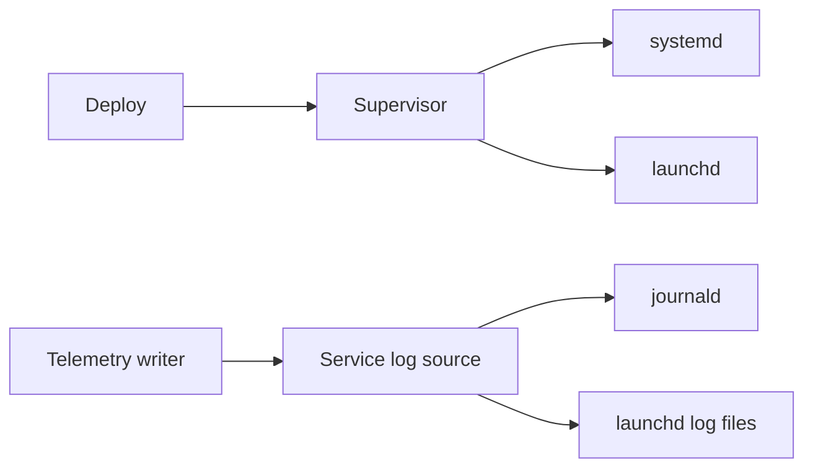

# Platforms

The daemon runs on Linux and on macOS. The CLI runs anywhere, Windows included. [[./design.md]] has the rest of the product.

## What differs

| Part | Linux | macOS |
|---|---|---|
| Service manager | systemd: unit files in `/etc/systemd/system` | launchd: plists in `/Library/LaunchDaemons` |
| Start, stop, restart | `systemctl start`, `stop`, `restart` | `launchctl bootstrap`, `bootout`, `kickstart -k` |
| App user | a system user per app, `useradd --system` | a hidden user per app, `_<app>`, made with `dscl` |
| Logs of apps without OTel | journald, read with `journalctl --output=json --follow` | launchd writes stdout and stderr to `<root>/logs/<app>.log`; siner tails the file and rotates it at 10 MB |
| Service events (start, exit, restart) | systemd's own journald records | siner polls `launchctl print system/siner.<app>` every 5 seconds and compares the PID and the last exit code |
| OOM kills | the kernel OOM killer, seen in journald | none; macOS swaps under memory pressure |
| Host metrics | `sysinfo` crate | `sysinfo` crate |
| Per-service CPU and memory | `sysinfo`, for the process tree under the service's PID | the same |
| Sandboxing | systemd flags: `ProtectSystem`, `NoNewPrivileges`, `PrivateTmp` | none; the app user is the only limit |
| Root directory | `/var/lib/siner` | `/usr/local/var/siner` |

An app lives in `<root>/apps/<app>/`: `releases/`, `current` (a link to one release), and `state/`. A Caddyfile points at `<root>/apps/<app>/current/...`.

## One code path where it can

- The unit or the plist runs `siner exec <app>`, never the app directly. `siner exec` asks the daemon for the app's secrets over a Unix socket, sets them as environment variables, and replaces itself with the app's command. The daemon checks the caller's user ID on the socket (`SO_PEERCRED` on Linux, `getpeereid` on macOS) and gives each app user only its own secrets. Secrets never touch the disk in plain text, and both platforms start an app the same way.
- Metrics use `sysinfo` on both platforms, so there is no metrics code per platform. cgroup v2 numbers on Linux are more exact and can come later.

## Where the platform code lives

Two interfaces, each with a Linux and a macOS implementation. `#[cfg(target_os)]` appears only in these implementations.

- `Supervisor`: install an app, uninstall it, start, stop, restart, status (PID, running or not, last exit code), and a stream of service events.
- Service log source: a source that sends log records and service events to the telemetry writer.

## Testing

- macOS: `mise check` runs every test natively. The launchd tests use the user domain (`gui/<uid>`, plists in `~/Library/LaunchAgents`), so they need no sudo.
- Linux: a Lima VM with Ubuntu 24.04, the same system as the droplet. The systemd tests use `systemd-run --user`, so they need no root. Lima forwards the VM's ports to the Mac's `localhost`, so a siner in the VM receives OTLP from apps on the Mac.
- CI: an `ubuntu-24.04` and a `macos` runner, each running the whole suite.
