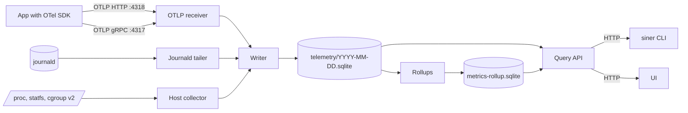
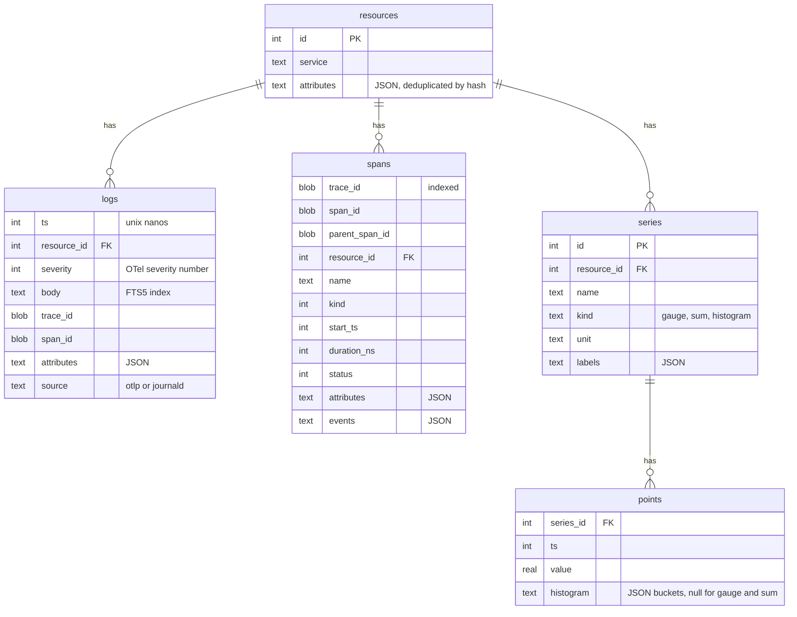

# Telemetry

How siner takes in logs, traces, and metrics, where it keeps them, and how a human or an agent reads them back. [[./design.md]] has the reasons for the whole product.

## Rules

- One writer task owns every write. Sources send batches to it over a bounded channel. When the channel is full, the source drops the batch and counts the drop, so a burst of telemetry never takes memory from the apps.
- SQLite in WAL mode. One file per UTC day for raw data. Retention deletes whole files. The defaults are 7 days of raw data, 14 days of 1-minute rollups, and 90 days of 1-hour rollups. [[../tasks/00008-roll-up-metrics-to-1-minute-and-1.md]] explains the rollups.
- A query that spans days attaches each day file. The query API caps a range at the retention, so the attach limit is never reached.
- `service` is the OTel `service.name` resource attribute. For a journald record it is the systemd unit without `.service`.
- Journald and the host collector read Linux interfaces. On macOS they compile to nothing, and their tests read recorded fixtures.

## Schema of a day file

## Querying

The CLI and the UI use the same HTTP query API. Every CLI command prints a table to a terminal and JSON otherwise, and `--json` and `--table` override that. Every query has a row limit. A cut result says so and names the flag that narrows it. Agents read what humans read, so the output stays small by default:

- `siner logs` groups lines by message template first, with counts, and prints samples. `--raw` prints lines.
- `siner traces` lists traces with the root span, duration, and error flag. `siner trace <id>` prints the span tree.
- `siner metrics <name>` prints a series at a step that fits the range.
- `siner sql` runs a read-only query against the day files.

Until UI auth exists, the daemon listens on `127.0.0.1` only, and a laptop reaches it through an SSH tunnel.
