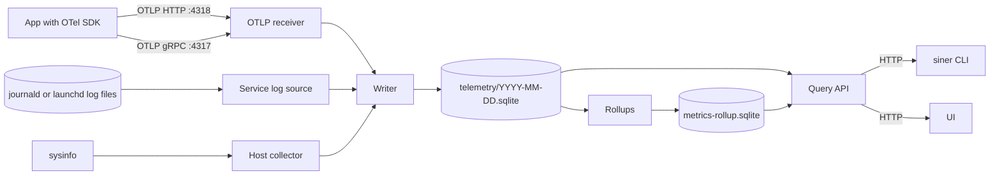
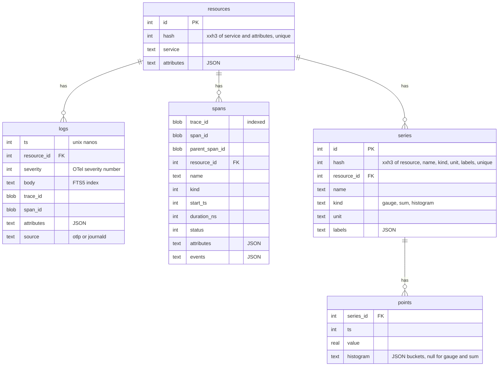

# Telemetry

How siner takes in logs, traces, and metrics, where it keeps them, and how a human or an agent reads them back. [[./design.md]] has the reasons for the whole product.



## Rules

- One writer task owns every write. Sources send batches to it over a bounded channel. When the channel is full, the source drops the batch and counts the drop, so a burst of telemetry never takes memory from the apps.
- SQLite in WAL mode. One file per UTC day for raw data. Retention deletes whole files. The defaults are 7 days of raw data, 14 days of 1-minute rollups, and 90 days of 1-hour rollups. [[../tasks/00008-roll-up-metrics-to-1-minute-and-1.md]] explains the rollups.
- A query that spans days attaches each day file. The query API caps a range at the retention, so the attach limit is never reached.
- `service` is the OTel `service.name` resource attribute. For a record from the service log source, it is the app name.
- The service log source has a Linux and a macOS implementation. [[./platforms.md]] describes both.

## Schema of a day file



The `attributes` and `labels` columns hold JSON objects. In Rust they are `Attributes`, a map of `AttributeValue`, which mirrors the `AnyValue` of OpenTelemetry: null, bool, int, double, string, array, and map. The JSON of the columns is the JSON of those types, so `json_extract` reads what the Rust code writes. A span event is a `SpanEvent` with its time, name, and attributes.

## OTLP receiver

The `siner-otlp` crate serves OTLP over HTTP on `127.0.0.1:4318` (protobuf or JSON, gzip or not) and over gRPC on `127.0.0.1:4317`. `siner serve --otlp-http` and `--otlp-grpc` move them. Both transports call one mapping to the rows:

- `service` is `service.name`, or `unknown_service` without one.
- The instrumentation scope becomes `otel.scope.name` and `otel.scope.version` on each record, and the status message of a span becomes `otel.status_description`, as the OTel spec maps them for formats without those fields. A log's `event_name` becomes `event.name`.
- A histogram point stores its sum as `points.value`. A point without buckets gets one bucket without bounds.
- Exponential histograms, summaries, and a span without valid IDs are rejected. Span links, severity text, and trace state are not kept.
- A rejected item, and every item of a request the full writer channel dropped, is counted in `partial_success`.

## The daemon's own telemetry

`siner serve` sends its own spans and logs over OTLP/HTTP to its own receiver, under the service `siner`, so siner can be tried and debugged on itself. `--own-telemetry off` keeps them on stderr only, and `--own-telemetry http://host:4318` sends them to another receiver. Every event also goes to stderr, where journald reads it.

- Each query API request gets a server span named after its route, such as `GET /api/logs`, with a child span for opening the reader and one `SELECT` span per SQLite statement, which carries the SQL and the rows it read. A 5xx response logs an error in the span.
- Nothing on the path from the OTLP receiver to the day files opens a span. A span there would make each export of the daemon's telemetry cause another export, forever. Events of the exporter's crates (`opentelemetry`, `reqwest`, `hyper`, `h2`, `tower`) stay on stderr for the same reason.
- On SIGTERM the daemon exports what it has queued before it stops its receivers, and what it logs after that reaches stderr only.

## Querying

The CLI and the UI use the same HTTP query API, which the `siner-api` crate serves. The Rust types of the daemon make its OpenAPI spec, which `siner openapi` prints. `packages/api` of the UI keeps it in `openapi.json` and generates its TypeScript types from it with `mise run api:generate`. A Rust test fails when `openapi.json` is behind the spec, and a test of `packages/api` fails when the types are behind `openapi.json`, so a change to the API reaches the UI's types. Every CLI command prints a table to a terminal and JSON otherwise, and `--json` and `--table` override that. Every query has a row limit. A cut result says so and names the flag that narrows it. Agents read what humans read, so the output stays small by default:

- `siner logs` groups lines by message template first, with counts, and prints samples. `--raw` prints lines.
- `siner spans` lists spans. `siner traces` lists the traces that have a matching span, by root span, duration, and error flag. `siner trace <id>` prints the span tree.
- `siner metrics` lists the series. `siner metric <name>` prints one metric at a step that fits the range.
- A histogram point keeps its buckets in `points.histogram` as JSON: `bounds`, `counts` (one more than the bounds), `count`, `sum`, `min`, `max`, and `cumulative`. The writer skips a point whose counts do not fit its bounds. `siner metric` merges the points of each step into one set of bucket counts with p50, p90, and p99 estimates. A cumulative point counts as its increase over the point before, a drop in the counts is a restart, and the first cumulative point of a range only sets where the counting starts. A step with points of different bounds keeps the newest bounds.
- `siner services` lists the services that sent spans or logs, the most requests first, with their requests, errors, p50, p95, and p99 latency, logs, and error logs. `siner service <name>` prints the same for one service and its requests by span name. A request is a span that enters the service: a root span, or a span of the server or the consumer kind. The percentiles come from buckets that each grow by 2%, so an estimate is off by 1% at most and the memory does not grow with the count of spans. `--buckets` adds the numbers of each step.
- `siner calls <name>` prints the calls a service makes, by target and by what they do, the most time first. A call is a span of the client or the producer kind, or a span with `db.system.name` or `db.system` of any kind, since an in-process database such as SQLite may mark its spans internal. Its target comes from the OpenTelemetry attributes, the older names too: a database by system and `db.namespace`, a host by `server.address` or the host of `url.full`, with a port other than 80 or 443, an RPC service by `rpc.system` and `rpc.service`, a message destination by `messaging.system` and `messaging.destination.name`, and else `peer.service`. What a call does is `db.query.summary`, or the query with each string, number, and parameter such as `$1` or `:id` as `?` and a list of them as one `?`, for a database; the method and `url.template`, or the path with each id as `{id}`, for HTTP; and the span name for the rest. So `SELECT * FROM users WHERE id = 7` and `… id = 8` are one row, and two queries under one span name such as `SELECT` are two. Each target carries the span query terms that keep its calls, such as `db.system.name = "postgresql" db.namespace = "app"`.
- `siner sql` runs a read-only query against the day files.

The logs page of the UI takes the same query, with completion from `/api/complete`, and a range of a preset or a custom `since` and `until`. It shows lines, or the message templates with their counts and samples. A line opens to its attributes and its resource, and a button next to a value adds `key = value` or `key != value` to the query. A template adds its fixed words to the query as `body ~ "…"` to show its lines. The page says which compared attributes have no index and can add one. Live mode reloads every 5 seconds. The query, the range, and the view live in the URL, so a link opens the same page.

The traces page takes a span query the same way. It lists the traces that have a matching span, by root span, span count, and duration, or the spans themselves. A span opens beside the list with its attributes, resource, and events, the same filter buttons, and a link to its trace. A trace opens in a modal over the list as a waterfall: each span under its parent, a bar where it runs on the time of the trace, and a fold for the children. A second tab shows the logs that carry the trace ID. The open trace lives in the URL of the list, so Back closes it. Each trace also has its own page, with the tab and the selected span in its URL, and the modal links to that page to share. A log line on the logs page links to its trace. The pages read what a span is from the OpenTelemetry conventions. An HTTP span shows its method, route, and status code on badges, and a database span the icon of its system, such as PostgreSQL or Redis, and the keyword of its query, in place of the words of the span name that say the same. Every span starts with an icon of what it is, a globe, the icon of a database system or a plain database, or a plain span, so the names of a list line up. Each span shows its kind on a badge, and each service the icon of its language from `telemetry.sdk.language`, or of code when the language is unknown. The icons live in the `@siner/icons` package. So the list of traces can do the same, `/api/traces` returns the kind, the attributes, and the resource of each root span.

The services page of the UI, its start page, lists the services of the range with the same numbers and a bar chart of the requests of each one, failed ones on top. A click on a column name sorts by it. A service opens its own page: the numbers of the range, then charts of the requests, the latency percentiles, the error rate, and the logs over the range, and its operations, the requests by span name and kind, each shown like a span, with the icon and badges of the attributes of its newest request. An operation opens in a modal over the page, with its numbers, its requests, latency, and error rate over the range from `/api/services/{name}/operation`, and its newest spans, each of which opens its trace. The open operation lives in the URL, so Back closes it. Its calls follow, from `/api/services/{name}/calls`: the time they take by target over the range, stacked for the 7 targets with the most time and the rest as one, their count over the range, and one table of what they do with the target of each, each shown like a span with the values taken out. A call opens in the same modal as an operation, from `/api/services/{name}/call`, which counts the calls of that target and summary and lists the newest 50 of them, and its target lives in the URL with it. The newest failed traces and the templates of the error logs close the page, with links to the traces and logs pages that show all of them. Dragging across a chart zooms the range to that stretch. The range and live mode live in the URL, and a link from one page to the other keeps the range.

## Query language

Every list takes one query, parsed by the `siner-query` crate. The daemon spec is at `/api/openapi.json`.

```text
http.route = "/matches" OR (user.id = 7 AND http.response.status_code = 200)
level >= warn body ~ "payment failed"
root = true AND duration > 500ms AND NOT resource.host.name = "droplet"
```

- A name is a built-in field of the signal, `resource.<key>` for a resource attribute, `attr.<key>` for an attribute named like a built-in field, or else a record attribute. A key with other characters goes in backticks.
- Built-in fields. Logs: `service`, `level`, `body`, `trace_id`, `span_id`, `source`. Spans: `service`, `name`, `kind`, `status`, `error`, `duration`, `root`, `trace_id`, `span_id`. Metrics: `name`, `service`, `kind`, `unit`, and the labels as attributes.
- Operators: `= != < <= > >=`, `in (…)`, `~` (words in a log body through FTS5, a substring elsewhere), `has(key)`, `AND`, `OR`, `NOT`, and parentheses. Terms next to each other join with `AND`.
- A number also matches the same number sent as a string. `!=` and `NOT` keep the records that lack the attribute.

## Catalog and completion

The writer keeps the attribute keys of each signal and of the resources in `attribute_keys` in every day file, with their JSON type and count. `attribute_values` keeps up to 200 values of each key, and marks a key with more as having many values. The writer only touches these tables for a new key or value and for the counts, once per transaction.

`siner complete <signal> <query>` and `/api/complete` suggest the fields, operators, values, and keywords that fit at the cursor, from the catalog of the retention. `siner attributes <signal>` lists the keys.

## Indexed attributes

`siner index add logs user.id` stores the key in `state.sqlite` and hands the set to the writer. Within a second the writer creates an expression index on `json_extract(attributes, '$."user.id"')` in every day file, and in each new one. `siner index remove` drops it. The query compiler writes the same expression, so SQLite uses the index, also for an `OR` of indexed keys. A query on a key without an index still runs by reading the range, and the response names the key, so the CLI says which index would help. Only logs and spans take indexes; resources and series are small.

Until UI auth exists, the daemon listens on `127.0.0.1` only, and a laptop reaches it through an SSH tunnel.
