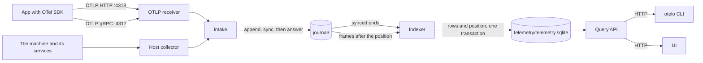
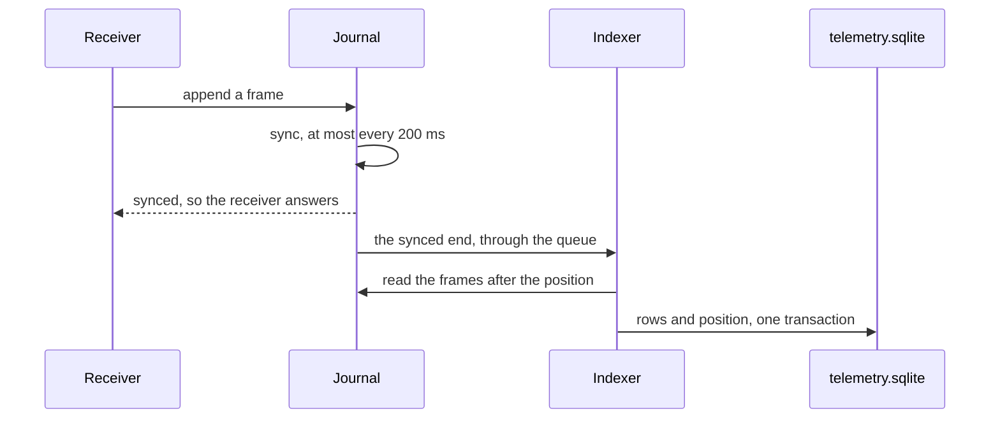
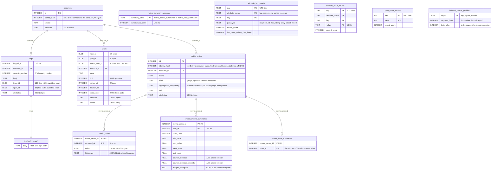

# Telemetry

How otelo takes in logs, traces, and metrics, where it keeps them, and how a human or an agent reads them back. [[./design.md]] has the reasons for the whole product.



## Rules

- One indexer thread owns every write to `telemetry.sqlite`, and reads what it writes from the journal. A burst of telemetry makes the indexer lag, and nothing is dropped.
- SQLite in WAL mode, in one file, `telemetry/telemetry.sqlite`. Each signal has its own retention, 7 days by default, and retention deletes rows. The 1-minute and 1-hour rollups of the metrics are kept as long as the raw points. [[../tasks/00008-roll-up-metrics-to-1-minute-and-1.md]] explains the rollups.
- No command runs SQL from a user, so the names of the tables and columns stay private to `otelo-indexed-storage-sqlite`.
- `telemetry.sqlite` carries a storage version, and nothing migrates a file of another one. `otelo reindex` builds it again from the journal, as the Indexer section says.
- A query is one connection to the file. The query API caps a range at the retention of its signal, and a range that reads two signals, such as a service, at the shorter of the two.
- The indexer keeps one connection open. Each connection keeps a page cache of 1 MB, and the daemon caps the heap of SQLite at 16 MB with `sqlite3_hard_heap_limit64`. The OS page cache keeps the hot pages.
- `service` is the OTel `service.name` resource attribute. The host collector builds its OTLP requests itself, so it names its services itself.

## Journal

The journal keeps every OTLP export request that otelo accepts, as protobuf, for 30 days. `otelo-journal` has the `Journal` trait that the receivers and the indexer of [[../tasks/00024-index-from-the-journal-and-rebui.md]] use, and `otelo-journal-files` keeps it on the local filesystem:

```
journal/
  logs/2026-10-03T14.seg          the open hour, appended to
  logs/2026-10-03T13.seg.zst      a closed hour
  traces/...
  metrics/...
```

- One segment per signal and UTC hour of receipt. A frame received in an hour before the open one goes to the open one, so a clock that goes back never reopens a closed hour.
- A frame is little-endian: the length `u32` of what follows the checksum, a CRC-32C `u32` of it, `received_at` as Unix nanoseconds `i64`, then the protobuf of the `Export*ServiceRequest`.
- A position is the hour and the offset in the segment before compression. A reader reads the open segment only up to what is synced.
- One thread per signal syncs the open segment, at most once every 200 ms. A failed sync stops the appends of that signal until the daemon starts again.
- When an append starts a new hour, the old segment is synced, and a maintenance thread compresses it with zstd at level 3 into a temporary file, syncs it, renames it to `.seg.zst`, and deletes the `.seg`.
- At startup, an unfinished frame at the end of a segment, a short one or one with a wrong checksum, is cut off with a warning that names the segment and the bytes cut. A `.seg` of a past hour is compressed, and a `.seg` next to its `.seg.zst` is deleted.
- The segments whose hour ended more than 30 days ago are deleted at startup and then once an hour.

## Indexer

The indexer of `otelo-indexed-storage-sqlite` builds `telemetry.sqlite` from the journal. A queue joins the two: each sync of the journal sends the end it synced, and the indexer reads the frames up to there.



- A message of the queue holds the signal, the synced end, and the `received_at` of the newest frame. It only wakes the indexer, which reads every synced frame, so a full queue drops a message and loses no frame. The queue keeps 1,024.
- The indexer maps up to 64 frames per transaction with `otelo-otlp/src/map.rs`, and writes their rows and the position after the last one into `indexed_journal_positions` in the same transaction, so a crash neither loses a frame nor indexes it twice.
- Without a position, or with one before the retention of its signal, the indexer starts at the hour the retention starts. It skips a frame received before the retention, and logs and skips a frame that does not decode.
- A frame the journal cannot read is logged, and the indexer tries that signal again a minute later.
- When the daemon stops, the journal stops after its last sync, and the indexer indexes what it synced before it ends.
- Between transactions the indexer applies the indexed attributes, deletes past the retention, and rolls the metrics up.

### Storage version and `otelo reindex`

- `STORAGE_VERSION` in `version.rs` goes into `PRAGMA user_version` when the file is made. `otelo serve` does not start on another version, or on a file without one: `telemetry.sqlite has storage version 3 and this otelo writes 4. Stop otelo and run otelo reindex.`
- A test keeps the xxh3 of `schema.sql` next to `STORAGE_VERSION`, so a change of the schema bumps both. A change of the mapping that changes what is stored bumps the version by hand.
- The daemon and `otelo reindex` both lock `telemetry/telemetry.lock`, so the command refuses to run next to a daemon. The lock is taken before the journal opens, because opening it recovers its segments.
- `otelo reindex` deletes a `telemetry.sqlite` of another version, makes it again with the indexed attributes of `state.sqlite`, and indexes the journal from the start of each retention, printing each signal and hour. A file of the current version goes on from its positions, so a reindex that stopped halfway goes on where it stopped.
- The rollups catch up from their cursors in the next `otelo serve`, as after a daemon that was down.

### The pipeline's own metrics

The receiver and the indexer count into one set of meters, and the host collector reports them every 15 seconds under the service `otelo`, so they reach the journal as any metric does and a reindex keeps them. Every series has `otelo.signal`: `logs`, `spans`, or `metrics`. No span opens on this path, because the daemon's own spans would export forever.

| Side | Metric | Kind | Unit | Attributes |
|---|---|---|---|---|
| receiver | `otelo.telemetry.received_requests` | counter | `{request}` | `otelo.telemetry.outcome`: `journaled`, `refused` |
| receiver | `otelo.telemetry.journaled_bytes` | counter | `By` | |
| receiver | `otelo.telemetry.journal_sync.duration` | histogram | `s` | the wait from the append to the sync, which the answer waits on |
| indexer | `otelo.telemetry.indexed_frames` | counter | `{frame}` | `otelo.telemetry.outcome`: `indexed`, `skipped` (before the retention), `undecodable` |
| indexer | `otelo.telemetry.indexed_records` | counter | `{record}` | `otelo.telemetry.outcome`: `written`, `skipped` (outside the retention), `rejected` (past 1,000 series) |
| indexer | `otelo.telemetry.index_transaction.duration` | histogram | `s` | |
| indexer | `otelo.telemetry.index_lag` | gauge | `s` | |

- `index_lag` is 0 once the indexer caught up. While it is behind, it is the `received_at` of the newest synced frame minus that of the newest indexed one.
- The histograms have the bounds 1, 2.5, 5, 10, 25, 50, 100, 250, and 500 ms, and 1, 2.5, and 5 s.
- `received_requests` against `indexed_frames` shows whether the indexer keeps up with the receiver, and `index_lag` how far behind it is in time.

## Schema of `telemetry.sqlite`



- A name says what a table or a column holds without its comment, and takes the OpenTelemetry name where OpenTelemetry has one: `severity_number`, `status_code`, `aggregation_temporality`.
- `metric_points`, the two summary tables, and the three count tables are `WITHOUT ROWID`. A trigger keeps `log_body_search` in step with `logs`, on an insert and on a delete.
- The file is made with `auto_vacuum = INCREMENTAL`, so it can give pages back to the disk.

The `attributes` columns hold JSON objects. In Rust they are `Attributes`, a map of `AttributeValue`, which mirrors the `AnyValue` of OpenTelemetry: null, bool, int, double, string, array, and map. The JSON of the columns is the JSON of those types, so `json_extract` reads what the Rust code writes. A span event is a `SpanEvent` with its time, name, and attributes.

## OTLP receiver

The `otelo-otlp` crate serves OTLP over HTTP on `127.0.0.1:4318` (protobuf or JSON, gzip or not) and over gRPC on `127.0.0.1:4317`. `otelo serve --otlp-http` and `--otlp-grpc` move them. Both transports call one mapping to the rows:

- `service` is `service.name`, or `unknown_service` without one.
- The instrumentation scope becomes `otel.scope.name` and `otel.scope.version` on each record, and the status message of a span becomes `otel.status_description`, as the OTel spec maps them for formats without those fields. A log's `event_name` becomes `event.name`.
- A series has one of four kinds, which say how its points combine over time. A gauge is a `gauge`. A sum is a `counter` when it is monotonic and an `updown` when it is not. A histogram and an exponential histogram are a `histogram`. A `counter` and a `histogram` keep their temporality, `cumulative` or `delta`. [[../tasks/00008-roll-up-metrics-to-1-minute-and-1.md]] has the table of the kinds.
- Points are stored as they arrive. The increase of a cumulative counter is computed when it is read.
- A histogram point stores its sum as `metric_points.value`. A point without buckets gets one bucket without bounds. An exponential histogram keeps its scale and its buckets, because the sender changes both as its values spread, and fixed bounds would not subtract.
- A point with the `NO_RECORDED_VALUE` flag is skipped. A query never fills a gap, so nothing needs a marker for the end of a series.
- The key of `metric_points` is the series and the time, so a batch that is sent again overwrites its points.
- Summaries, a delta sum that is not monotonic, a sum or a histogram without a temporality, and a span without valid IDs are rejected. Span links, severity text, trace state, exemplars, and the start time of a point are not kept.
- Proto3 JSON leaves out a field at its default, and the decoder of `opentelemetry-proto` takes a point of an exponential histogram only with every field. The receiver fills the missing ones before it decodes.
- The receiver appends each request to the journal, encoded again as protobuf when it came as JSON or with gzip, and answers once the frame is synced. A request the journal cannot keep gets 503 over HTTP and `UNAVAILABLE` over gRPC, so the client retries it, and it never reaches the index.
- A rejected item is counted in `partial_success`. The receiver maps each request only to count them, and drops what it maps. The indexer maps the frame again.
- A metric gets at most 1,000 series in the file, so one attribute that holds a user ID cannot fill the disk. The indexer skips the points of a series past that. The receiver has answered by then, so the indexer counts them in `otelo.telemetry.indexed_records` with the outcome `rejected`, and warns in its log.

## Host collector

The `otelo-host` crate reads the machine once when the daemon starts, and then every 15 seconds, on the wall-clock multiples of 15 seconds. It builds an `ExportMetricsServiceRequest`, which goes to the journal as a request the receiver took does. It has no flag and no configuration. [[../tasks/00007-collect-host-and-service-metrics.md]] has the plan, and [[./platforms.md]] says where each number comes from.

OpenTelemetry treats a host as a resource of its own and gives host metrics no service name. The `service` column needs one, so otelo names itself, as an app that reports the metrics of its host does:

- The metrics of the machine and of otelo itself have the service `otelo`.
- The metrics of a service have the name of its systemd unit without `.service`, or its launchd label. A unit named like the `service.name` its app sends puts these numbers next to the telemetry of the app.
- Every resource carries `host.name`, `host.id`, `host.arch`, and `os.type`. A query finds the machine by `resource.host.name` and the `system.*` names, not by the service.

| Metric | Kind | Unit | Attributes |
|---|---|---|---|
| `system.cpu.utilization` | gauge | `1` | `cpu.mode` on Linux: `user`, `nice`, `system`, `interrupt`, `iowait`, `steal`, `idle`. The shares add up to 1. |
| `system.cpu.load_average.1m`, `.5m`, `.15m` | gauge | `{thread}` | |
| `system.memory.usage` | updown | `By` | `system.memory.state`: `used`, `free`, and on Linux `cached` and `buffers` |
| `system.memory.limit` | updown | `By` | |
| `system.paging.usage` | updown | `By` | `system.paging.state`: `used`, `free` |
| `system.filesystem.usage` | updown | `By` | `system.device`, `system.filesystem.mountpoint`, `system.filesystem.type`, and `system.filesystem.state`: `used`, `free` |
| `system.network.io` | counter | `By` | `network.interface.name`, and `network.io.direction`: `receive`, `transmit` |
| `process.cpu.time` | counter | `s` | |
| `process.memory.usage` | updown | `By` | |
| `process.cgroup.memory.usage` | updown | `By` | |
| `otelo.storage.size` | updown | `By` | `otelo.storage.file`: `journal`, `telemetry`, `state` |

- The kinds are the four of the model in [[../tasks/00008-roll-up-metrics-to-1-minute-and-1.md]]. A counter is cumulative, and a chart shows its rate.
- The names, units, and attributes are the OpenTelemetry semantic conventions for system and process metrics, which are still in development and can change. Three names are not from there: the load averages have the names the OpenTelemetry Collector gives them, and `process.cgroup.memory.usage` and `otelo.storage.size` are otelo's.
- `iowait` is the time the CPUs sat idle waiting for the disk, and `steal` the time the hypervisor gave to another tenant. Without the two, a slow droplet at 30% CPU looks healthy.
- The `process.*` metrics cover a whole service, every process of its unit, and otelo's own process. `process.memory.usage` is the memory the processes hold themselves. `process.cgroup.memory.usage`, on Linux only, adds the page cache the unit filled, which is what `MemoryMax` and the OOM killer count.
- `otelo.storage.size` is the size of otelo's data. The journal reports its size through `Journal::size_in_bytes()` and the storage backend through `Storage::size()`, so the collector knows no file names. The SQLite backend adds up its files, and a WAL file counts with its database. The free space of the disk under them is in `system.filesystem.usage`.
- A filesystem counts once per device, under its shortest mount point. Filesystems without a disk, such as `tmpfs`, `overlay`, and `squashfs`, are left out. So are the loopback interface and every interface that has moved no bytes.
- A reading that fails, or a list of services that cannot be read, is a warning in the log. The collector sends what it has and tries again at the next tick.

## Rollups

The indexer sums the points of each series up by the minute in `metric_minute_summaries` and by the hour in `metric_hour_summaries`, so a long range reads fewer rows. [[../tasks/00008-roll-up-metrics-to-1-minute-and-1.md]] has the reasons.

- A row is one series and one minute or hour that has points, with the instant it starts in `start_at`: the count, minimum, maximum, sum, and last of the values, and for a `counter` how much it grew and over how many seconds, and for a `histogram` its merged buckets. A summary of a `counter` or a `histogram` holds what each step added, so a query of the summaries reports its temporality as `delta`.
- Once a minute the indexer summarizes the minutes that ended 2 minutes ago or earlier, so a late batch is in them. An hour is summarized from its 60 minutes once all of them are.
- `metric_summary_progress` says up to where the minutes and the hours are summarized. A daemon that was down starts there, or at the oldest point when the table is empty, and summarizes an hour at a time with frames taken in between.
- The rollup reads the points series by series, through the primary key, so it reads only the points of the minutes it summarizes.
- A row is written with its key, the series and the start, so summarizing a step again gives the same row.
- The logic that sums points up by step is one type in `otelo-indexed-storage`. The query of the raw points and the rollups both use it, so a minute of summaries equals a minute of raw points.

## Retention

Each signal has its own setting in the indexer's `Config`: `logs_retention_days`, `traces_retention_days`, and `metrics_retention_days`, 7 days by default. A day counts whole, so 7 days keep today and the 6 days before it. The indexer skips a record older than the retention of its signal, or more than a day ahead, and a whole frame received before the retention.

When the daemon starts, and then once an hour, the indexer deletes what is past the retention, in transactions of up to 10,000 rows, so the WAL stays small and a frame waits little. The indexer takes frames between the transactions.

| Signal | Deletes |
|---|---|
| logs | `logs` by `logged_at`, through its index. The trigger deletes the row from `log_body_search`. |
| traces | `spans` by `started_at`, through its index |
| metrics | `metric_points` and the two summary tables, one series at a time by its primary key, then the series that have no rows left |

- A resource that no row refers to is deleted with the metrics. `logs` and `spans` have an index on `resource_id` and the time, so the check reads an index and not the tables.
- The catalog deletes the days past the retention of their signal. A resource belongs to every signal, so its keys stay as long as the longest retention.
- Deleted pages go to the freelist, and new rows reuse them, so the file keeps its size without a `VACUUM`. When the freelist passes a quarter of the file, after a retention was lowered, the indexer runs `PRAGMA incremental_vacuum` in steps of 2,048 pages.

## The daemon's own telemetry

`otelo serve` sends its own spans and logs over OTLP/HTTP to its own receiver, under the service `otelo` and with the host attributes of the host collector, so otelo can be tried and debugged on itself. `--own-telemetry off` keeps them on stderr only, and `--own-telemetry http://host:4318` sends them to another receiver. Every event also goes to stderr, where journald reads it.

- Each query API request gets a server span named after its route, such as `GET /api/logs`, with a child span for opening the reader and one `SELECT` span per SQLite statement, which carries the SQL and the rows it read. A 5xx response logs an error in the span.
- Nothing on the path from the OTLP receiver to the telemetry file opens a span. A span there would make each export of the daemon's telemetry cause another export, forever. Events of the exporter's crates (`opentelemetry`, `reqwest`, `hyper`, `h2`, `tower`) stay on stderr for the same reason.
- On SIGTERM the daemon exports what it has queued before it stops its receivers, and what it logs after that reaches stderr only.

## Querying

The CLI and the UI use the same HTTP query API, which the `otelo-api` crate serves. The Rust types of the daemon make its OpenAPI spec, which `otelo openapi` prints. `packages/api` of the UI keeps it in `openapi.json` and generates its TypeScript types from it with `mise run api:generate`. A Rust test fails when `openapi.json` is behind the spec, and a test of `packages/api` fails when the types are behind `openapi.json`, so a change to the API reaches the UI's types. Every CLI command prints a table to a terminal and JSON otherwise, and `--json` and `--table` override that. Every query has a row limit. A cut result says so and names the flag that narrows it. Agents read what humans read, so the output stays small by default:

- `otelo logs` groups lines by message template first, with counts, and prints samples. `--raw` prints lines. `/api/logs/counts` counts the lines a query keeps over the range and by step, and groups them by `service`, `level`, attributes, or `resource.<key>`, the most lines first, each group with its own steps. A `level` groups every severity number of it, so `info` holds 9 to 12.
- `otelo spans` lists spans. `otelo spans --by` and `/api/spans/groups` group the spans a query keeps by the values of attributes, `service`, `name`, or `resource.<key>`, with the count, errors, total time, and p50, p95, and p99 latency of each group, and the name and the attributes of its newest span. The group with the most time comes first, and a group lacks a name its spans lack. With `group_buckets`, each group also has the numbers of each step. A second read of the spans tallies them for the groups the limit kept, so the memory grows with the limit and not with the count of groups. The answer has the same numbers for all the spans, over the range and by step. A value keeps its JSON type, so a bool is `true` and not `1`. The groups take the attribute values as the spans have them, so an app that puts values into `db.query.text` instead of parameters gets a group for each value. `otelo traces` lists the traces that have a matching span, by root span, duration, and error flag. `otelo spans` and `otelo traces` list the newest first, and `--sort oldest`, `longest`, or `shortest` and the `sort` of `/api/spans` and `/api/traces` change the order, so the limit keeps the slowest of the range and not the slowest of the newest. A trace sorts by its root span, and a tie goes newest first. `otelo trace <id>` prints the span tree.
- `otelo metrics` lists the series. `otelo metric <name>` prints one metric at a step that fits the range: the count, minimum, average, maximum, and last value of each step for a `gauge` and an `updown`, the rate for a `counter`, and the percentiles for a `histogram`.
- A range of 6 hours at most reads the raw points. A range of 14 days at most reads the summaries by the minute, and a longer one those by the hour. `--resolution raw`, `1m`, or `1h` picks one. A step of summaries is rounded up to whole minutes or hours, and the answer says which step and which points it read.
- The rate of a counter is its increase between two neighbouring points, divided by the time between them and not by the step, so a 30-second step over points a minute apart stays right. A cumulative value that goes down is a restart, and the increase counts from zero. The query also reads the 5 minutes before the range, so the first step has a point to count from.
- A histogram point keeps its buckets in `metric_points.histogram` as JSON: `count`, `sum`, `min`, `max`, and either `bounds` and `counts` (one more than the bounds), or `scale`, `zero_count`, `positive`, and `negative` for an exponential histogram. The indexer skips a point whose counts do not fit its bounds. `otelo metric` merges the points of each step into one set of bucket counts with p50, p90, and p99 estimates. A cumulative point counts as its increase over the point before, a drop in the counts is a restart, and the first cumulative point only sets where the counting starts. A step with points of different bounds keeps the newest bounds.
- Two exponential points always merge. Both go down to the lower scale, where each step joins neighbouring buckets in pairs. The API returns every distribution with explicit bounds, and joins the buckets of an exponential one until 64 are left. The percentiles are estimated before that. An explicit and an exponential point in one step do not merge, and the step keeps the newer one.
- `otelo metric --by` and the `by` of `/api/metrics/{name}` group the series of a metric by attributes, `service`, or `resource.<key>`, and combine the series of a group in each step: a `gauge` takes their average, an `updown` adds them up, a `counter` adds up its rates, and a `histogram` merges its buckets. The minimum and the maximum of series that add up are the sums of theirs, since their points do not line up in time. A series with no point in a step adds nothing to it. Series of different kinds or units never combine, and histogram points of different explicit bounds do not merge, so the step keeps one of them.
- The groups come highest first, by their value over the range: the average of a `gauge` and an `updown`, the rate of a `counter`, and the sum of the values of a `histogram`, which for a duration is the total time. `--top N` keeps N groups and combines the rest into one group `other`, and `--limit` drops the rest. Without `--by` each series is its own group, so `otelo metric process.memory.usage --top 5` names the 5 services with the most memory. A group needs every series of the metric, so a query reads up to 2,000 series and says so when it stops there.
- `otelo services` lists the services that sent spans or logs, the most requests first, with their requests, errors, p50, p95, and p99 latency, spans of any kind, logs, and error logs. A service that sent spans but no requests is listed with none, and its page shows it instead of saying it sent nothing. `otelo service <name>` prints the same for one service, its routes, and its database queries. A request is a span of the server kind with `http.request.method`. The routes are its requests grouped by `http.request.method` and `http.route`, and the database queries its spans with `db.system.name` grouped by `db.system.name`, `db.namespace`, and `db.query.text`, both from `/api/spans/groups`. The percentiles come from buckets that each grow by 2%, so an estimate is off by 1% at most and the memory does not grow with the count of spans. `--buckets` adds the numbers of each step.

The logs page of the UI takes the same query, with completion from `/api/complete`, and a range of a preset or a custom `since` and `until`. It shows lines, or the message templates with their counts and samples. A line opens to its attributes and its resource, and a button next to a value adds `key = value` or `key != value` to the query. A template adds its fixed words to the query as `body ~ "…"` to show its lines. The page says which compared attributes have no index and can add one. Live mode reloads every 5 seconds. The query, the range, and the view live in the URL, so a link opens the same page.

The traces page takes a span query the same way. It lists the traces that have a matching span, by root span, span count, and duration, or the spans themselves. A click on Time or Duration sorts both lists by it, newest or longest first, and a second click turns the order around. The daemon sorts, and the sort lives in the URL. A span opens beside the list with its attributes, resource, and events, the same filter buttons, and a link to its trace. A trace opens in a modal over the list as a waterfall: each span under its parent, a bar where it runs on the time of the trace, and a fold for the children. A second tab shows the logs that carry the trace ID. The open trace lives in the URL of the list, so Back closes it. Each trace also has its own page, with the tab and the selected span in its URL, and the modal links to that page to share. A log line on the logs page links to its trace. The pages read what a span is from the OpenTelemetry conventions. An HTTP span shows its method, route, and status code on badges, in place of the words of the span name that say the same. A database span shows the icon of its system, such as PostgreSQL or Redis, and its query as the span has it, or its name when it has no query, with the first word on a badge when it is letters alone, such as `SELECT`. One function splits the text, so the traces pages, the database queries of a service, and its modal show a query the same way. Every span starts with an icon of what it is, a globe, the icon of a database system or a plain database, or a plain span, so the names of a list line up. Each span shows its kind on a badge, and each service the icon of its language from `telemetry.sdk.language`, or of code when the language is unknown. The icons live in the `@otelo/icons` package. So the list of traces can do the same, `/api/traces` returns the kind, the attributes, and the resource of each root span.

The services page of the UI, its start page, lists the services of the range with the same numbers and a bar chart of the requests of each one, failed ones on top. A click on a column name sorts by it. A service opens its own page: the numbers of the range, then charts of the requests, the latency percentiles, the error rate, and the logs over the range, and its routes, each shown like a span, with the icon and badges of the attributes of its newest request. A route opens in a modal over the page, with its numbers, its requests, latency, and error rate over the range from `/api/spans/groups` with the span query of the route, and its newest 50 spans from `/api/spans` with the same query, each of which opens its trace. The query adds a term for each value of the group, and `NOT has(<key>)` for a value the group lacks. The open modal lives in the URL as its span query, so Back closes it. Its CPU and memory follow, from the `process.*` metrics the host collector stores under the name of the unit: the CPU time as a share of one core, and the memory of its processes with the memory of its cgroup beside it on Linux. The page reads only the series without `telemetry.sdk.name`, so process metrics an app sends from its own SDK do not add up with them. A service whose unit has another name has none of them, and the page says so and names the three metrics. Its database queries follow: the time they take and their count over the range, and a table of them by database and query text. A query opens in the same modal as a route. The newest failed traces and the templates of the error logs close the page, with links to the traces and logs pages that show all of them. Dragging across a chart zooms the range to that stretch. The range and live mode live in the URL, and a link from one page to the other keeps the range.

The metrics page lists the metric names of the range from `/api/metrics`, each with its kinds, units, and count of series. It reads up to 10,000 series and says so when more match. It takes the metrics query with completion, and the same query narrows the series of the open metric. A metric opens beside the list, with a chart for each kind and unit it has. A `gauge` and an `updown` draw the average of each step, a `counter` its rate per second, and a `histogram` its P50, P90, and P99, in one chart for one group and in a chart per percentile for several. A value stands for the empty steps after it for up to 5 minutes, as a sample does in Prometheus, so an app that sends every minute draws a line at a step of 30 seconds. A menu sets the `by` of `/api/metrics/{name}` from the attributes, `service`, and the resource keys whose values differ between the series, and a select sets `top`. The name is in the path, and the query, the range, the grouping, and live mode in the URL. Dragging across a chart zooms the range.

## Dashboards

A dashboard is a page of widgets that the user puts together, after the dashboards of Datadog. `state.sqlite` keeps them in `dashboards`, with the widgets as JSON, since a journal cannot rebuild them. `/api/dashboards` lists, saves, replaces, and deletes them, and `otelo dashboard` does the same from a JSON file, so an agent can write a dashboard. The daemon checks each query and grouping name before it saves, and names the widget that fails.

- A widget has a title, a width of 1 to 12 columns, a height of 2 to 16 rows of 40 pixels, and what it draws: a `timeseries` of up to 8 queries, a line per group, a `value` of one query over the range with its trend, a `toplist` that ranks the groups of one query, or a `note` of text.
- A query reads `spans` (their count, rate, errors, error rate, or p50, p95, or p99), `logs` (their count), or a metric by name (the average, minimum, maximum, last value, rate, or p50, p90, or p99 of each step). Each takes a filter in the query language of its signal, and a query of a time series or a top list takes the names to group by. Without them it is one series: the series of a metric add up as the groups of `/api/metrics/{name}` do.
- The widgets read `/api/spans/groups` with `group_buckets`, `/api/logs/counts`, and `/api/metrics/{name}`. A grouped time series keeps the 10 groups highest over the range.
- The Dashboards page lists the dashboards with a search over their names and descriptions. A dashboard shows its widgets in their order on a grid of 12 columns on a wide screen. A narrower screen has 6 columns, where a widget spans half its width rounded up, or 2 on a phone, where a widget of 3 columns or fewer spans one and every other widget both. The rows keep their height. A narrower grid fills the holes that the rounding leaves with later widgets, and the wide grid keeps the order as it is. The grid follows the width of its container, not of the window.
- Edit turns the dashboard into a draft: the name, the description, and each widget can change, be duplicated, or be removed, and an editor shows the widget it builds as it changes. Dragging the header of a widget moves it before or after the widget it is dropped on, and dragging its corner resizes it by whole columns and rows. The arrow keys resize it from the corner too. Save replaces the dashboard, and Cancel drops the draft. Removing a widget and deleting the dashboard each ask first.
- Outside a draft, the header of a widget shows an edit button on hover, and always on a touch screen. The editor it opens saves the dashboard when it applies.
- The editor groups a query by the names that a select lists: the fields of the signal, the attribute and resource keys of its catalog, or, for a metric, the keys of its series. Its search also takes a name the list lacks. The range and live mode live in the URL and apply to every widget.

## Query language

Every list takes one query, parsed by the `otelo-query` crate. The daemon spec is at `/api/openapi.json`.

```text
http.route = "/matches" OR (user.id = 7 AND http.response.status_code = 200)
level >= warn body ~ "payment failed"
root = true AND duration > 500ms AND NOT resource.host.name = "droplet"
```

- A name is a built-in field of the signal, `resource.<key>` for a resource attribute, `attr.<key>` for an attribute named like a built-in field, or else a record attribute. A key with other characters goes in backticks.
- Built-in fields. Logs: `service`, `level`, `body`, `trace_id`, `span_id`. Spans: `service`, `name`, `kind`, `status`, `error`, `duration`, `root`, `trace_id`, `span_id`. Metrics: `name`, `service`, `kind`, `unit`, and the attributes of the series.
- Operators: `= != < <= > >=`, `in (…)`, `~` (words in a log body through FTS5, a substring elsewhere), `has(key)`, `AND`, `OR`, `NOT`, and parentheses. Terms next to each other join with `AND`.
- A number also matches the same number sent as a string. `!=` and `NOT` keep the records that lack the attribute.

## Catalog and completion

The indexer counts the attribute keys of each signal and of the resources by UTC day, in `attribute_key_counts`, with their JSON type in `json_type` and the count of records in `record_count`. The `attribute_owner` of a row says whose keys they are: a `log`, a `span`, a `metric_series`, or a `resource`. A resource and a series count once on each day that has their records. `attribute_value_counts` keeps up to 200 values of each key and day, and `has_more_values_than_listed` marks a key that has more. `span_name_counts` counts the names of the spans, up to 200 a day. The indexer only touches these tables for a new key or value and for the counts, once per transaction.

`otelo complete <signal> <query>` and `/api/complete` suggest the fields, operators, values, and keywords that fit at the cursor, from the counts of the days of the retention, added up. `otelo attributes <signal>` lists the keys.

## Indexed attributes

`otelo index add logs user.id` stores the key in `state.sqlite` and hands the set to the indexer. Within a second the indexer creates an expression index on `json_extract(attributes, '$."user.id"')` on the table, once. The index is named `logs_attribute_<hash>`, after its table and a hash of the key. `otelo index remove` drops it. The query compiler writes the same expression, so SQLite uses the index, also for an `OR` of indexed keys. A query on a key without an index still runs by reading the range, and the response names the key, so the CLI says which index would help. Only logs and spans take indexes; resources and series are small.

Until UI auth exists, the daemon listens on `127.0.0.1` only, and a laptop reaches it through an SSH tunnel.
