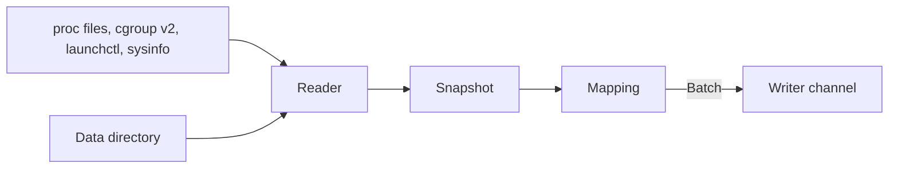

# Collect host and service metrics

A new crate, `otelo-host`, reads the machine every 15 seconds and sends metric points to the writer. It has no flag and no configuration. [[../docs/telemetry.md]] lists the metrics, their labels, and the service each one gets. [[../docs/platforms.md]] says where each number comes from on Linux and on macOS.

## What it measures

- The machine: CPU utilization by mode, load averages, memory and swap by state, each real filesystem, and each network interface.
- Every service the service manager runs: CPU time and memory. The collector finds them itself, from the cgroups of systemd on Linux and from `launchctl list` on macOS.
- otelo itself, always: the CPU time and memory of its own PID, and the size of its data directory by kind of file.

## How it runs

- One thread of its own. The readers block, so they stay off the async runtime.
- A tick on every wall-clock multiple of 15 seconds. Every point of a tick carries the time of the tick, so the series line up in the buckets of [[./00008-roll-up-metrics-to-1-minute-and-1.md]].
- The reader fills a `Snapshot`, a plain struct of the numbers it read. The mapping turns the snapshot and the one before it into a `Batch`. The CPU shares are a change between two snapshots, so the first tick sends none.
- The batch goes to the writer through a clone of the `Sender` the OTLP receivers use. Nothing goes through OTLP. A full channel drops the batch, and the collector logs a warning.
- The thread ends on the shutdown token of `otelo serve`, before the writer ends.

## Resources

- `host.name`, `host.id`, `host.arch`, and `os.type` are read once at start and go on every resource the collector sends.
- The machine and otelo itself have the service `otelo`. A service has the name of its unit without `.service`, or its launchd label.
- `own.rs` puts the same four attributes on the resource of the daemon's own spans and logs.

## Rules of the mapping

- A filesystem counts once per device, under its shortest mount point. On macOS the volumes of one APFS container, such as `disk3s1` and `disk3s5`, share their free space and count once as `disk3`. Filesystems without a disk are left out: `tmpfs`, `devtmpfs`, `overlay`, and `squashfs`, which keeps the snap mounts of Ubuntu out.
- The loopback interface is left out, and so is an interface with no bytes in either direction. macOS has a dozen idle `utun` and `awdl` interfaces.
- The unit or the launchd job that holds otelo's own PID is left out of the services, so otelo counts once.
- On Linux a unit without the memory files of its cgroup still sends its CPU time.
- On macOS `sysinfo` lists every process each tick. The mapping adds the CPU time each live process under a service's PID gained since the last tick to a running total of that service. The total starts at zero when the daemon starts.

## Open: a counter and a level are the same kind today

`system.network.io` and `process.cpu.time` are counters: totals that only grow, which a chart shows as a rate. The `usage` metrics are levels that go up and down. OpenTelemetry calls both a sum and tells them apart by `is_monotonic`. `MetricKind::Sum` does not keep that flag, and the OTLP mapping drops it together with the temporality. The rollups of [[./00008-roll-up-metrics-to-1-minute-and-1.md]] and the charts need it to choose between a rate and a minimum and maximum. Whether `series` learns it in a task before this one or inside [[./00008-roll-up-metrics-to-1-minute-and-1.md]] is not decided. This task sends the counters as `sum` either way.

## Size

About 100 series on the droplet: 25 for the machine and otelo, and 3 for each of about 25 units. [[./00008-roll-up-metrics-to-1-minute-and-1.md]] counts with 50.

## Tests

- The mapping, on built snapshots: the CPU shares from two readings, the memory states, one point per device and per APFS container, the interfaces left out, otelo's own unit left out, and the running total of a macOS service when a child exits between two ticks.
- The parsers, on recorded text: the first line of `/proc/stat`, `/proc/meminfo`, `cpu.stat`, `memory.stat`, `cgroup.events`, `launchctl list`, and the `ioreg` output.
- The readers of cgroups and of the data directory, on a directory a test builds.
