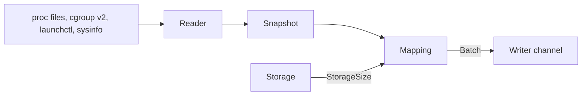

# Collect host and service metrics

A new crate, `otelo-host`, reads the machine every 15 seconds and sends metric points to the writer. It has no flag and no configuration. [[../docs/telemetry.md]] lists the metrics, their labels, and the service each one gets. [[../docs/platforms.md]] says where each number comes from on Linux and on macOS.

## What it measures

- The machine: CPU utilization by mode, load averages, memory and swap by state, each real filesystem, and each network interface.
- Every service the service manager runs: CPU time and memory. The collector finds them itself, from the cgroups of systemd on Linux and from `launchctl list` on macOS.
- otelo itself, always: the CPU time and memory of its own PID, and the size of its data by kind of file.

## How it runs

- A task on the async runtime of `otelo serve` owns the tick, next to the receivers in `run_daemon`, and ends on the shutdown token.
- `otelo-host` is synchronous and does not depend on tokio. One call reads the machine and returns the batch of a tick. The task runs that call in `spawn_blocking`, never on a worker thread: the droplet has one vCPU, so the runtime has one worker, and a read that hangs, such as `statvfs` on a stuck mount, would stop the receivers and the API.
- The first reading comes when the daemon starts, with the time of the start. Every later one comes on a wall-clock multiple of 15 seconds and carries the time of that tick, so the series line up in the buckets of [[./00008-roll-up-metrics-to-1-minute-and-1.md]].
- The reader fills a `Snapshot`, a plain struct of the numbers it read. The mapping turns the snapshot and the one before it into a `Batch`. The CPU shares are a change between two snapshots, so the first tick sends none.
- The batch goes to the writer through a clone of the `Sender` the OTLP receivers use. Nothing goes through OTLP. A full channel drops the batch, and the writer reports it with the other dropped batches.
- A reading that fails is a warning in the log, and the task tries again at the next tick. A list of services that cannot be read is one warning, and the collector sends the rest.
- The readers pick their source with `cfg!(target_os)`, so every reader compiles on every platform, and the tests of the Linux files run on a Mac.
- A tick that is still running when the next one is due makes the task skip that one.

## Storage size

`otelo-host` does not look at the data directory. Which files hold the data is knowledge of the storage backend, and a backend may keep no files.

- The `Storage` trait gets a `size()` method that returns a `StorageSize`: the bytes of the telemetry and the bytes of the state. [[./00008-roll-up-metrics-to-1-minute-and-1.md]] adds the bytes of the rollups.
- The SQLite backend adds up its own files: the day files for the telemetry and `state.sqlite` for the state. A `-wal` and a `-shm` file count with their database.
- The task in `serve.rs` calls `size()` in the same `spawn_blocking` as the read and hands the result to the collector with the time of the tick. The mapping turns it into `otelo.storage.size`.
- A `size()` that fails is logged, and the tick sends the rest.

## Resources

- `host.name`, `host.id`, `host.arch`, and `os.type` are read once at start and go on every resource the collector sends.
- The machine and otelo itself have the service `otelo`. A service has the name of its unit without `.service`, or its launchd label.
- `own.rs` puts the same four attributes on the resource of the daemon's own spans and logs.

## Rules of the mapping

- A filesystem counts once per device, under its shortest mount point. `sysinfo` gives the name of a volume on macOS and not its device, so the container of an APFS volume cannot be read from a name such as `disk3s5`. The volumes of one container all report its size and its free space, so the APFS filesystems with the same two numbers count once. Filesystems without a disk are left out: `tmpfs`, `devtmpfs`, `overlay`, and `squashfs`, which keeps the snap mounts of Ubuntu out.
- The loopback interface is left out, and so is an interface with no bytes in either direction. macOS has a dozen idle `utun` and `awdl` interfaces.
- The unit or the launchd job that holds otelo's own PID is left out of the services, so otelo counts once.
- On macOS the `application.*` labels are left out with the `com.apple.*` ones. They are the apps a user opened.
- On Linux a unit without the memory files of its cgroup still sends its CPU time.
- On macOS `sysinfo` lists every process each tick. The mapping adds the CPU time each live process under a service's PID gained since the last tick to a running total of that service. The total starts at zero when the daemon starts.

## Kinds

The collector uses the four kinds of the model in part 1 of [[./00008-roll-up-metrics-to-1-minute-and-1.md]], which lands before this task:

- `counter`, cumulative: `system.network.io` and `process.cpu.time`. They are totals that only grow, and a chart shows their rate.
- `updown`: the `usage` metrics, `system.memory.limit`, and `otelo.storage.size`. They are levels that go up and down.
- `gauge`: `system.cpu.utilization` and the load averages.

## Size

About 100 series on the droplet: 25 for the machine and otelo, and 3 for each of about 25 units.

## Tests

- The mapping, on built snapshots: the CPU shares from two readings, the memory states, one point per device and per APFS container, the interfaces left out, otelo's own unit left out, the storage size by kind, and the running total of a macOS service when a child exits between two ticks.
- The parsers, on recorded text: the first line of `/proc/stat`, `/proc/meminfo`, `cpu.stat`, `memory.stat`, `cgroup.events`, `launchctl list`, and the `ioreg` output.
- The reader of cgroups, on a directory a test builds.
- `size()` of the SQLite backend, on a data directory a test builds, with WAL files in it.
