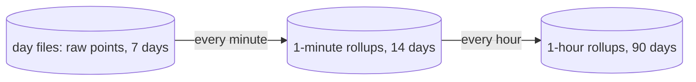

# Roll up metrics to 1-minute and 1-hour points

This task has two parts. The first gives a series the kind a reader needs, and changes how points are kept. The host collector of [[./00007-collect-host-and-service-metrics.md]] and the rollups both build on it, so it lands first. The second part is the rollups.

## Part 1: the model

### Four kinds

Today a series is a `gauge`, a `sum`, or a `histogram`. `sum` does not say how its points combine over time, because the OTLP mapping drops `isMonotonic` and the temporality.

| Kind | OTLP | Example | Over a time step | Chart |
|---|---|---|---|---|
| `gauge` | gauge | CPU share, load | min, max, avg, last | line |
| `updown` | sum, not monotonic | memory used, queue length | the same as a gauge | line, stacks across series |
| `counter` | sum, monotonic | bytes sent, CPU seconds | the increase | rate per second |
| `histogram` | histogram, exponential histogram | request duration | merged bucket counts | percentiles |

- A `counter` and a `histogram` have a temporality, `cumulative` or `delta`. It is a column of `series` and part of the series hash. A histogram point no longer carries a `cumulative` flag.
- A delta sum that is not monotonic is rejected. Its level is a running total with no known start, and SDKs send these sums cumulative.
- In Rust the temporality sits inside the two variants that have one, so a gauge with a temporality cannot be written.
- Points are stored as they arrive. The increase of a cumulative counter is computed when it is read.
- Summaries stay rejected, and `startTimeUnixNano` stays dropped. A value that goes down is a restart of the counter.
- A point with the `NO_RECORDED_VALUE` flag is skipped, as now. A query never fills a gap, so nothing needs a marker for the end of a series.

### Exponential histograms

The receiver accepts them and stores them as they arrive. Converting one to fixed bounds would lose counts, because the sender changes `scale` and `offset` as its values spread, and two points with different bounds do not subtract.

- `Histogram` has two shapes: explicit bounds with counts, and `scale`, the zero count, and the positive and negative buckets with their offsets.
- Two exponential points add and subtract exactly. Both go down to the lower scale, where each step joins neighbouring buckets in pairs, and then line up by index.
- Bucket `i` covers the values from `base^i` to `base^(i+1)`, with `base = 2^(2^-scale)`. The percentile estimate walks the buckets as it does for explicit bounds.
- The API returns every distribution with explicit bounds, so the CLI and the UI have one shape to read.
- An explicit and an exponential point in one step do not merge. The step keeps the newer shape and counts the skip.
- The latency percentiles of the services page use buckets that grow by 2%. Share the bucket math with them if it fits.

### Storage

- `points` becomes `WITHOUT ROWID` with the key `(series_id, ts)`. A point is then stored once, not in a table and again in an index, and the insert becomes an upsert. A retried OTLP batch overwrites its rows, where it now doubles them.
- A day file has a schema version in `PRAGMA user_version`. The reader skips a file of another version. The writer moves it aside and starts a new one, and retention deletes the moved file with its day.
- A metric gets at most 1,000 series per day file. The writer skips the points of a series past that and counts them in `otelo.telemetry.rejected_points`, next to `otelo.telemetry.dropped_batches`, with a warning in the log. The receiver has answered by then, so `partial_success` cannot say it.

### Reading

- A bucket of a counter has its rate per second: the increase between two neighbouring points, divided by the time between them. Dividing by the gap and not by the step keeps a 30-second step over 60-second points right.
- The query also reads the 5 minutes before the range, so the first bucket has a point to count from. The apps export every minute, so those minutes hold it.
- The logic that turns points into an increase or a merged distribution lives once in `otelo-storage`. The raw query and the rollup job both call it.
- `otelo metric` prints the rate of a counter. The `kind` field of the query language takes the four names.

## Part 2: the rollups

### Why

Metrics live in the day files with the logs and spans, and retention deletes a whole day file after 7 days. Without rollups, a metric chart can never go back more than 7 days. Raw points are also too many for a long range: one series at a 15-second interval has 40,320 points in a week. A 30-day chart of memory would read 172,800 rows to draw a line a few hundred pixels wide.

Rollups keep a small summary of each series per minute and per hour in their own file, so metrics outlive the day files and a long range reads few rows.

### Data flow

Both rollup tables are in `metrics-rollup.sqlite`. A day file numbers its series itself, so the rollup file keeps its own `series` table, keyed by a hash of the resource, the name, the kind, the unit, and the labels. A rollup point is already an increase or a merged distribution, so a rolled up `counter` or `histogram` has the temporality `delta`.

### What one rollup point holds

A point covers one series and one bucket (a minute or an hour).

| Kind | Stored per bucket | Why |
|---|---|---|
| `gauge`, `updown` | min, max, sum, count, last | An average hides a spike. Max shows it. |
| `counter` | the increase in the bucket, and the seconds it covers | The chart wants the rate, which is the increase divided by those seconds. For a cumulative counter a value that goes down is a restart: the increase counts from zero. For a delta counter the increase is the sum of the deltas. |
| `histogram` | count, sum, and the merged buckets, explicit or exponential | Merging bucket counts keeps percentiles. An average of p99s is wrong. Explicit points with different bounds do not merge: the rollup keeps the bounds of the newest point and counts the skip. Exponential points always merge. |

### The file

`metrics-rollup.sqlite` lives in the telemetry directory, next to the day files. It has the `resources` and `series` tables of a day file, so the compiled query of a day file reads it too. The table `cursors` says up to where the minutes and the hours are rolled up.

A rollup file of another schema version does not open: the daemon logs the error and keeps no rollups. A later change of its schema needs a step that moves the rows over.

### When it runs

- Every minute, the job rolls up the minute that ended 2 minutes ago. The 2 minutes let late batches arrive first.
- Every hour, the job rolls up the hour before from the 1-minute points, not from raw points.
- A write is an upsert on (series, bucket start), so running a bucket again gives the same result. At start the job fills the buckets it missed while the daemon was down, as far back as raw data exists. It rolls up an hour at a time, and the writer takes batches in between.
- Retention deletes 1-minute rows older than 14 days and 1-hour rows older than 90 days, once an hour.

### Which table a query reads

The metrics query in [[./00009-serve-the-query-api.md]] picks the finest table that has data for the whole range and gives at most about 1,000 points:

| Range | Reads |
|---|---|
| up to 6 hours | raw points |
| up to 14 days | 1-minute points |
| longer | 1-hour points |

A range that starts before the finer points are kept reads the next coarser ones. A query can force a table with `resolution`: `raw`, `1m`, or `1h`. A step of summaries is rounded up to whole minutes or hours, and the answer names the step and the resolution it read. The list of the series picks its table the same way. A range of metrics can go back the 90 days of the hours, where the logs and the spans stop at 7.

### Size

The host collector of [[./00007-collect-host-and-service-metrics.md]] makes about 100 series. 14 days of 1-minute points is 20,160 rows per series, and 90 days of 1-hour points is 2,160. For 100 series that is about 2.2 million rows.

`Storage::size()` of [[./00007-collect-host-and-service-metrics.md]] gets the bytes of the rollup file, so `otelo.storage.size` reports it.

## Tests

- The mapping from OTLP: a monotonic and a not monotonic sum, each temporality, a rejected delta sum that is not monotonic, and an exponential histogram.
- Two exponential histograms of different scales, added and subtracted.
- The rate of a cumulative counter with a restart, of a delta counter, and over a step shorter than the gap between points.
- A batch written twice leaves each point once.
- A metric past 1,000 series: its points are skipped and counted.
- A day file of another schema version is moved aside.
- A gauge, a counter with a restart, a delta counter, and both histogram shapes, each rolled up and compared with the expected numbers.
- A bucket rolled up twice gives the same row.
- A gap while the daemon was down gets filled at start.
- The query picks the table from the range.
