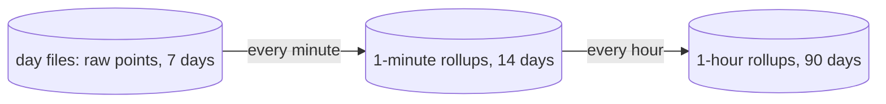

# Roll up metrics to 1-minute and 1-hour points

## Why

Metrics live in the day files with the logs and spans, and retention deletes a whole day file after 7 days. Without rollups, a metric chart can never go back more than 7 days. Raw points are also too many for a long range: one series at a 15-second interval has 40,320 points in a week. A 30-day chart of memory would read 172,800 rows to draw a line a few hundred pixels wide.

Rollups keep a small summary of each series per minute and per hour in their own file, so metrics outlive the day files and a long range reads few rows.

## Data flow

Both rollup tables are in `metrics-rollup.sqlite`. A day file numbers its series itself, so the rollup file keeps its own `series` table, keyed by a hash of the resource, the name, and the labels.

## What one rollup point holds

A point covers one series and one bucket (a minute or an hour).

| Kind | Stored per bucket | Why |
|---|---|---|
| Gauge (memory used, disk free) | min, max, sum, count, last | An average hides a spike. Max shows it. |
| Sum, monotonic (bytes sent, CPU seconds) | the increase in the bucket | The raw value is a running total. The chart wants the rate, which is increase divided by bucket length. A value that goes down is a counter reset: the increase counts from zero. |
| Sum, not monotonic (queue length) | the same as a gauge | It goes up and down like a gauge. |
| Histogram (request duration) | count, sum, and the count of each bucket | Merging bucket counts keeps percentiles. An average of p99s is wrong. Points with different bucket bounds do not merge: the rollup keeps the bounds of the newest point and counts the skip. |

OTLP sends a sum as cumulative or delta. The receiver stores what it gets, and the rollup handles both: for delta, the increase is the sum of the deltas.

## When it runs

- Every minute, the job rolls up the minute that ended 2 minutes ago. The 2 minutes let late batches arrive first.
- Every hour, the job rolls up the hour before from the 1-minute points, not from raw points.
- A write is an upsert on (series, bucket start), so running a bucket again gives the same result. At start the job fills the buckets it missed while the daemon was down, as far back as raw data exists.
- Retention deletes 1-minute rows older than 14 days and 1-hour rows older than 90 days, once an hour.

## Which table a query reads

The metrics query in [[./00009-serve-the-query-api.md]] picks the finest table that has data for the whole range and gives at most about 1,000 points:

| Range | Reads |
|---|---|
| up to 6 hours | raw points |
| up to 14 days | 1-minute points |
| longer | 1-hour points |

A query can force a table with `resolution`.

## Size

The host collector makes about 50 series. 14 days of 1-minute points is 20,160 rows per series, and 90 days of 1-hour points is 2,160. For 50 series that is about 1.1 million rows, tens of MB.

## Tests

- A gauge, a monotonic sum with a reset, a delta sum, and a histogram, each rolled up and compared with the expected numbers.
- A bucket rolled up twice gives the same row.
- A gap while the daemon was down gets filled at start.
- The query picks the table from the range.
