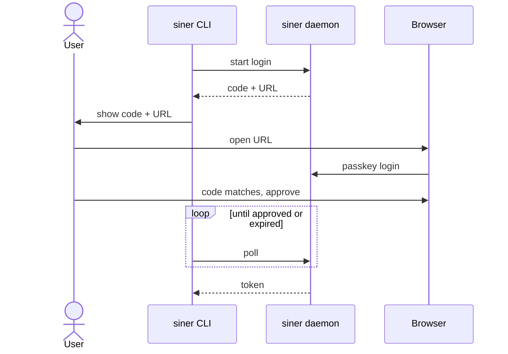

# Authenticate with passkeys and scoped tokens

The UI uses passkeys (WebAuthn). The CLI, CI, and agents use scoped tokens, and a passkey session creates them. Access to the server over SSH is the root of trust. This replaces the GitHub device flow in [[../docs/design.md]].

## Requirements

- The UI has a hostname behind Caddy with HTTPS. `siner init --domain <host>` sets the RP ID. A passkey works only on that domain, so a new domain needs a new enrollment. `http://localhost` works for development.
- `webauthn-rs` does the WebAuthn work. Credentials go into the state SQLite as JSON. Pending challenges stay in memory with a short TTL.

## Flows

- Enroll: `siner auth link --enroll`, run on the server, prints a URL that works once and expires after 10 minutes. The page calls `navigator.credentials.create()`. A logged-in session can add more passkeys.
- Login: one button calls `navigator.credentials.get()` with discoverable credentials. There is no username field. Success sets a session cookie: `HttpOnly`, `Secure`, `SameSite=Strict`. Every write checks `Origin`.
- Recovery: `siner auth link --login`, run on the server, prints a one-time login URL.
- CLI login: siner runs its own device flow.

## Tokens

Scopes: `admin`, `deploy:<app>`, `read`. A `read` token queries logs, traces, metrics, and status. It cannot deploy, restart, or see secret names, so an agent gets `read`. CI gets `deploy:<app>` from `siner token create --scope deploy:<app>`, in the UI or on the server.

Siner stores a hash of each token and shows the token once. Each token has a label, a last-used time, and an optional expiry. The UI lists and revokes tokens.

## Open decisions

- Drop GitHub login completely? Proposal: yes.
- Session length: 30 days, or 12 hours?
- One user for now, or enroll links that carry a role (admin or read-only)?
