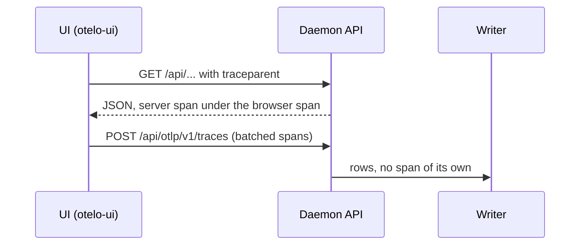

# Trace the web UI and join its spans to the daemon's

The daemon traces its own requests, but nothing measures the UI. A service page once took 4 s to show its data after a 14 ms response, and no span showed it. The UI should send its own spans as the service `otelo-ui`, and each API request should join the trace of the browser span that made it.

- Spans: the page load, each route change until the DOM settles after its data arrives, each API fetch, and long tasks. A failed fetch marks its span as failed.
- The UI exports to `POST /api/otlp/v1/traces` on the API's own origin, so it needs no CORS and works through the SSH tunnel that reaches only :7070. The route hands the rows to the writer as the OTLP receiver does.
- The ingest route opens no span, as the rule in [[../docs/telemetry.md]] asks for the path from the receiver to the day files; otherwise every export makes another.
- The trace middleware in `crates/otelo/src/api/mod.rs` reads the W3C `traceparent` header and sets it as the parent of the request's server span.

Decide first: the official OpenTelemetry JS SDK (`@opentelemetry/sdk-trace-web`, the fetch and document-load instrumentations, the OTLP/HTTP exporter; about 40 to 60 KB gzipped on a 43 KB bundle) or a small tracer written for otelo (about 3 KB, only what the list above needs). The route-render spans are custom either way.
