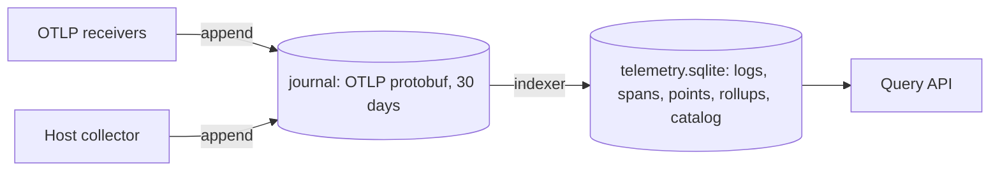

# Rebuild the index from a journal of OTLP

Otelo will run on mudro's droplet before the storage design settles. Today each change of the schema means deleting the data. This work keeps what otelo receives in a journal, and makes every SQLite table of telemetry a materialization of the journal that `otelo reindex` rebuilds at any time.

- The journal holds the OTLP export requests as protobuf. OTLP keeps its wire format compatible, so the journal has no version and never changes format.
- `telemetry.sqlite` holds everything a query reads. All of it is derived data under the same rules: one `STORAGE_VERSION`, a retention per signal, and a rebuild by `otelo reindex`. The rollups are part of it, with the retention of the metrics.
- `state.sqlite` holds what no journal can rebuild: the indexed attributes, and later the users and tokens. [[./00013-authenticate-with-passkeys-and-s.md]] gives it migrations.

| Setting | Default |
|---|---|
| `journal_retention_days` | 30 |
| `logs_retention_days` | 7 |
| `traces_retention_days` | 7 |
| `metrics_retention_days` | 7 |

An index retention longer than the journal's fails the startup, because a reindex could not rebuild those days.

[[./00012-send-mudro-s-traces-to-a-local-s.md]] measures the journal and the index on mudro's traffic.
