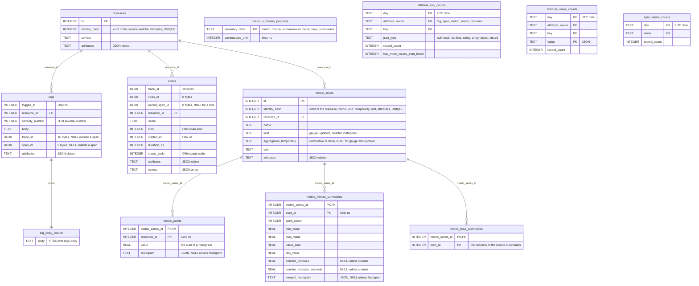

# Keep the index in one SQLite file

Today the index is one SQLite file per UTC day and `metrics-rollup.sqlite`. Retention deletes whole files, and a query attaches up to 9 day files and reads them through `UNION ALL` views. A retention per signal does not fit files that hold every signal, so the index becomes one file and retention deletes rows.

## The file

- `telemetry/telemetry.sqlite` has the tables of a day file today, plus the summaries and their progress from `rollup.sql`. The rollup file, its copy of `resources` and `series`, and the matching of series across files by `SeriesKey` go away.
- The reader is one connection to that file. `ATTACH`, the views, their `day` column, and `MAX_ATTACHED_DAYS` go away.
- The writer keeps one connection open.
- `PRAGMA auto_vacuum = INCREMENTAL` is set when the file is created, before the first table.
- Both connections set a small `cache_size`, and the daemon caps the heap of SQLite with `sqlite3_hard_heap_limit64`. The OS page cache keeps the hot pages. Each reader today can take 2 MB of cache per attached file, which does not fit the 50 MB of [[../docs/design.md]].

## Schema

`telemetry.sqlite` after this task. It holds the tables of a day file and of `rollup.sql` once each, under the names below.

### Names

Most names of today are otelo's own, `cursors` among them. A new name says what a table or a column holds without its comment, and takes the OTel name where OTel has one, marked OTel below.

| Today | After | Why |
|---|---|---|
| `resources.hash`, `series.hash` | `identity_hash` | It is a hash of what makes the row the same row, for deduplication. |
| `logs.severity` | `severity_number` | OTel: `severity_number`. The text is `severity_text`, which otelo does not keep. |
| `logs.source` | removed | It is `otlp` on every row, and with the journal everything arrives as OTLP. |
| `logs_fts` | `log_body_search` | The full-text search over the bodies of the logs. |
| `spans.status` | `status_code` | OTel: `status.code`. |
| `series` | `metric_series` | A series of what. |
| `series.labels` | `attributes` | OTel renamed labels to attributes. |
| `series.temporality` | `aggregation_temporality` | OTel: `aggregation_temporality`. |
| `points` | `metric_points` | OTel: data points. |
| `minutes`, `hours` | `metric_minute_summaries`, `metric_hour_summaries` | A row summarizes the points of one series in one minute or hour. |
| `count`, `min`, `max`, `sum`, `last` | `point_count`, `min_value`, `max_value`, `value_sum`, `last_value` | Of the points in the step. |
| `increase`, `seconds` | `counter_increase`, `counter_increase_seconds` | Only a counter has them. |
| `histogram` in a summary | `merged_histogram` | The buckets of the step's points, merged. |
| `cursors` | `metric_summary_progress` | How far the rollup job has summarized the points. |
| `cursors.rollup`, `rolled_until` | `summary_table`, `summarized_until` | |
| `attribute_keys`, `attribute_values` | `attribute_key_counts`, `attribute_value_counts` | They count the records of a day that carry a key or a value, for completion. |
| `key_group` | `attribute_owner` | Whose attributes: a `log`, a `span`, a `metric_series`, or a `resource`. |
| `value_type` | `json_type` | The JSON type of the values. |
| `count` in the catalog | `record_count` | |
| `key_group = 'span_names'` | `span_name_counts` | Span names are not attributes, so they get their own table. |

The sql skill names a column after the Rust field that holds it, so the Rust fields and types change with the columns: `Metric::labels` becomes `attributes`, `KeyGroup` becomes `AttributeOwner`, and so on. The SQL in `packages/ui/tests/sql.test.ts` and the [[../docs/telemetry.md]] doc change in the same commit.

### The rest of the schema

- `PRAGMA auto_vacuum = INCREMENTAL` is new, and `journal_mode = WAL` and `synchronous = NORMAL` stay.
- The indexes keep their columns and take the new table names: `logs_logged_at`, `logs_trace_id`, `spans_trace_id`, `spans_started_at`, `metric_series_name`, and the `logs_attribute_<hash>` and `spans_attribute_<hash>` indexes of [[../docs/telemetry.md]].
- `metric_points`, the two summary tables, and the three count tables are `WITHOUT ROWID`.
- A trigger deletes the row of `log_body_search` when retention deletes a log.

## Retention

Each signal has its own setting, 7 days by default: `logs_retention_days`, `traces_retention_days`, `metrics_retention_days`. The API caps the range of a query at the retention of its signal.

Once an hour the writer deletes what is older than the retention, in transactions of about 10,000 rows, so the WAL stays small and a batch waits little.

| Signal | Deletes |
|---|---|
| logs | `logs` by `logged_at`. A trigger deletes the row from `log_body_search`. |
| traces | `spans` by `started_at` |
| metrics | `metric_points` and the two summary tables, one series at a time by its primary key, then the series that have no rows left |

Deleting one series at a time uses the primary key `(metric_series_id, recorded_at)`, so `metric_points` needs no second index for retention. A resource that no row refers to anymore is deleted with the metrics.

Deleted pages go to the freelist, and new rows reuse them, so the file keeps its size without a `VACUUM`. When the freelist passes a quarter of the file, after a retention was lowered, the writer runs `PRAGMA incremental_vacuum` in steps.

## The catalog

`attribute_keys` and `attribute_values` count per file today, and retention forgets them with the file. As `attribute_key_counts`, `attribute_value_counts`, and `span_name_counts` they get a `day` column, and retention deletes the days past the retention of their signal. Completion and `otelo attributes` add the counts of the days in the range. The 200 values kept per key become 200 per key and day.

## The rest

- The limit of 1,000 series per metric counts the series in the file. Retention frees the series of old labels.
- `MetricRetention` has one oldest time for the raw points and the rollups. The query picks raw points, minutes, or hours by the length of the range only.
- `StorageSize` loses `rollup_bytes`, and `otelo.storage.file` loses `rollup`.
- An indexed attribute is one index on the whole table. `otelo index add` builds it once, in the writer.
- No code reads the day files of today. Delete them, as the sql skill says.
- The [[../docs/telemetry.md]] doc and the Storage section of [[../docs/design.md]] change in the same commit.

## Tests

- Retention deletes the rows of one signal and leaves the others.
- A deleted log no longer matches a full-text search.
- The catalog drops a key whose last day passed the retention.
- Retention of the metrics deletes a series with no rows left, and keeps a series that still has points.
- Lowering a retention shrinks the file after the incremental vacuum.
- A query over a range reads raw points, minutes, or hours by its length.
