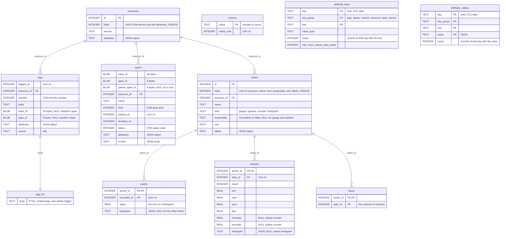

# Keep the index in one SQLite file

Today the index is one SQLite file per UTC day and `metrics-rollup.sqlite`. Retention deletes whole files, and a query attaches up to 9 day files and reads them through `UNION ALL` views. A retention per signal does not fit files that hold every signal, so the index becomes one file and retention deletes rows.

## The file

- `telemetry/telemetry.sqlite` has the tables of a day file today, plus `minutes`, `hours`, and `cursors` from `rollup.sql`. The rollup file, its copy of `resources` and `series`, and the matching of series across files by `SeriesKey` go away.
- The reader is one connection to that file. `ATTACH`, the views, their `day` column, and `MAX_ATTACHED_DAYS` go away.
- The writer keeps one connection open.
- `PRAGMA auto_vacuum = INCREMENTAL` is set when the file is created, before the first table.
- Both connections set a small `cache_size`, and the daemon caps the heap of SQLite with `sqlite3_hard_heap_limit64`. The OS page cache keeps the hot pages. Each reader today can take 2 MB of cache per attached file, which does not fit the 50 MB of [[../docs/design.md]].

## Schema

`telemetry.sqlite` after this task. It holds the tables of a day file and of `rollup.sql` once each. The comments mark what changes.

- `PRAGMA auto_vacuum = INCREMENTAL` is new, and `journal_mode = WAL` and `synchronous = NORMAL` stay.
- The indexes stay as they are: `logs_logged_at`, `logs_trace_id`, `spans_trace_id`, `spans_started_at`, `series_name`, and the `logs_attribute_<hash>` and `spans_attribute_<hash>` indexes of [[../docs/telemetry.md]].
- `points`, `minutes`, `hours`, `attribute_keys`, and `attribute_values` stay `WITHOUT ROWID`.
- Gone: the copy of `resources` and `series` in `metrics-rollup.sqlite`.

## Retention

Each signal has its own setting, 7 days by default: `logs_retention_days`, `traces_retention_days`, `metrics_retention_days`. The API caps the range of a query at the retention of its signal.

Once an hour the writer deletes what is older than the retention, in transactions of about 10,000 rows, so the WAL stays small and a batch waits little.

| Signal | Deletes |
|---|---|
| logs | `logs` by `logged_at`. A trigger deletes the row from `logs_fts`. |
| traces | `spans` by `started_at` |
| metrics | `points`, `minutes`, and `hours`, one series at a time by its primary key, then the series that have no rows left |

Deleting one series at a time uses the primary key `(series_id, recorded_at)`, so `points` needs no second index for retention. A resource that no row refers to anymore is deleted with the metrics.

Deleted pages go to the freelist, and new rows reuse them, so the file keeps its size without a `VACUUM`. When the freelist passes a quarter of the file, after a retention was lowered, the writer runs `PRAGMA incremental_vacuum` in steps.

## The catalog

`attribute_keys` and `attribute_values` count per file today, and retention forgets them with the file. They get a `day` column, and retention deletes the days past the retention of their signal. Completion and `otelo attributes` add the counts of the days in the range. The 200 values kept per key become 200 per key and day.

## The rest

- The limit of 1,000 series per metric counts the series in the file. Retention frees the series of old labels.
- `MetricRetention` has one oldest time for the raw points and the rollups. The query picks raw points, minutes, or hours by the length of the range only.
- `StorageSize` loses `rollup_bytes`, and `otelo.storage.file` loses `rollup`.
- An indexed attribute is one index on the whole table. `otelo index add` builds it once, in the writer.
- No code reads the day files of today. Delete them, as the sql skill says.
- The [[../docs/telemetry.md]] doc and the Storage section of [[../docs/design.md]] change in the same commit.

## Tests

- Retention deletes the rows of one signal and leaves the others.
- A deleted log no longer matches a full-text search.
- The catalog drops a key whose last day passed the retention.
- Retention of the metrics deletes a series with no rows left, and keeps a series that still has points.
- Lowering a retention shrinks the file after the incremental vacuum.
- A query over a range reads raw points, minutes, or hours by its length.
