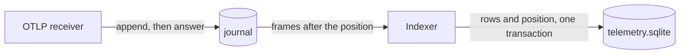

# Index from the journal and rebuild with otelo reindex

The indexer builds `telemetry.sqlite` from the journal of [[./00023-journal-the-otlp-that-otelo-rece.md]], and `otelo reindex` builds it again after a change of the storage.

## The indexer

- A thread reads the frames of each signal after its position, maps them with `otelo-otlp/src/map.rs`, and writes them as the writer does now. It takes up to 64 frames per transaction.
- `telemetry.sqlite` gets a table `indexed_journal_positions`: per `signal`, the `segment_hour` and the `byte_offset` in the segment before compression, up to which the frames are indexed. The indexer writes it in the transaction of the rows, so a crash neither loses a frame nor writes it twice.
- Frames older than the retention of their signal are skipped.
- The batch channel goes away, with `dropped_batches` and `otelo.telemetry.dropped_batches`. A burst makes the indexer lag. Nothing drops it.
- `otelo.telemetry.index_lag` is a gauge of the seconds between the newest frame of the journal and the newest frame indexed.
- The receiver still runs the mapping, only to fill `partial_success`, and drops what it maps. Mapping is cheap next to the inserts.
- With no `telemetry.sqlite`, the indexer creates it and reads the journal from its start.

## The version

- `STORAGE_VERSION` in `otelo-storage-sqlite` goes into `PRAGMA user_version` when the file is created.
- `otelo serve` reads it at startup. Another version fails the startup with: `telemetry.sqlite has storage version 3 and this otelo writes 4. Stop otelo and run otelo reindex.` A file without a version, from before this task, is another version too.
- A test keeps a hash of `schema.sql` next to `STORAGE_VERSION`. When the schema changes and the hash does not, the test fails and says to bump both.
- A change of the mapping that changes what is stored bumps `STORAGE_VERSION` by hand.
- The sql skill drops the rule to delete the telemetry files after a change, and says to bump `STORAGE_VERSION`.

## otelo reindex

- It runs with the daemon stopped. The daemon and the command both lock `telemetry.lock`, so the command refuses to run next to a daemon.
- It deletes `telemetry.sqlite`, creates it with the current version and the indexed attributes of `state.sqlite`, and replays the retention of each signal from the journal. It prints the progress by signal and hour.
- The rollups catch up from their cursors, as after a daemon that was down.
- A reindex that stops halfway leaves a file of the current version and its positions. The next `otelo serve` or `otelo reindex` goes on from there.

## Tests

- An indexer killed in the middle of a transaction resumes with every frame once.
- A file of another version fails the startup with the message.
- A reindex gives the same answers to the queries as the live indexing of the same frames.
- Frames older than the retention are skipped.
- `otelo reindex` refuses to run while the daemon holds the lock.
- The hash of `schema.sql` matches the one next to `STORAGE_VERSION`.

## Comments

### 2026-10-03T17:33:30Z by Milan Suk via claude-code

> otelo reindex deletes telemetry.sqlite only when its storage version differs or it has none; a file of the current version is continued from its positions, since the task asks both for a delete and for a halfway reindex to go on.
