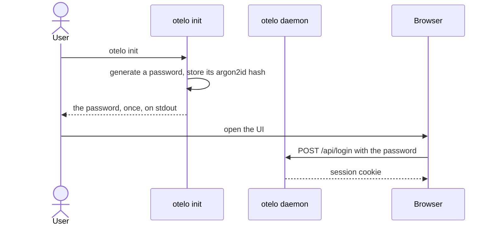

# Log in with a static password

Passkeys and tokens ([[./00013-authenticate-with-passkeys-and-s.md]]) are a large task. To run otelo on the droplet sooner, the UI and the CLI log in with one password that `otelo init` generates. The daemon still listens on `127.0.0.1`, and Caddy puts the UI on a hostname with HTTPS.

## otelo init

- It takes `--data` as `otelo serve` does. It generates a password of 128 random bits as 26 characters of base32, prints it once on stdout, and stores only its argon2id hash, as a PHC string, in `state.sqlite`.
- A data directory that has a password already makes `otelo init` refuse. `otelo init --new-password` replaces the password and ends every session.
- `otelo serve` on a data directory without a password fails the startup and says to run `otelo init`. `mise dev` runs `otelo init` when the dev data has no password.

## Login in the UI

- Every path under `/api` needs a session, except `POST /api/login`. The files of the UI need none, and the UI shows a login page with one password field when the API answers 401.
- `POST /api/login` checks the password against the hash. A match creates a session of 256 random bits, sent as the cookie `otelo_session`: `HttpOnly`, `SameSite=Strict`, and `Secure` unless the page is on `http://localhost`. `POST /api/logout` ends it.
- `state.sqlite` keeps the SHA-256 of each session, when it was created, and when it was last used. A session ends 30 days after its last use.
- Every write checks `Origin`.
- argon2id takes CPU and about 19 MiB per check, and the droplet has one CPU. The daemon checks one login at a time, at most one a second, and a wrong password answers after that second.
- The OTLP receivers stay without a login, on `127.0.0.1`.

## Login in the CLI

`otelo login` reads the password without echo, calls `POST /api/login`, and keeps the session in the config directory of the user, under the address of `OTELO_URL`. Each request sends it as `Authorization: Bearer <session>`. `otelo logout` ends it.

## Migrations of state.sqlite

The password and the sessions are the first data otelo keeps that no journal can rebuild ([[./00021-rebuild-the-index-from-a-journal.md]]), so `state.sqlite` gets migrations in this task:

- An ordered list of SQL steps in the code. `PRAGMA user_version` is the number of steps applied.
- At open, each step after it runs once, in a transaction with the new `user_version`.
- The table `telemetry_indexes` of today is step 1.
- A file with a `user_version` past the last step, from a newer otelo, fails the startup.

## Tests

- `otelo init` prints a password and stores only its hash. A second `otelo init` refuses, and `--new-password` ends the sessions.
- `otelo serve` without a password fails the startup.
- A right password gets a session, and a wrong one gets 401 after the wait.
- `/api` answers 401 without a session, with an expired one, and with one ended by logout.
- A write with another `Origin` is refused.
- `otelo login` keeps the session, and the next command sends it.
- The migrations bring a new file and a file of step 1 to the last step.
