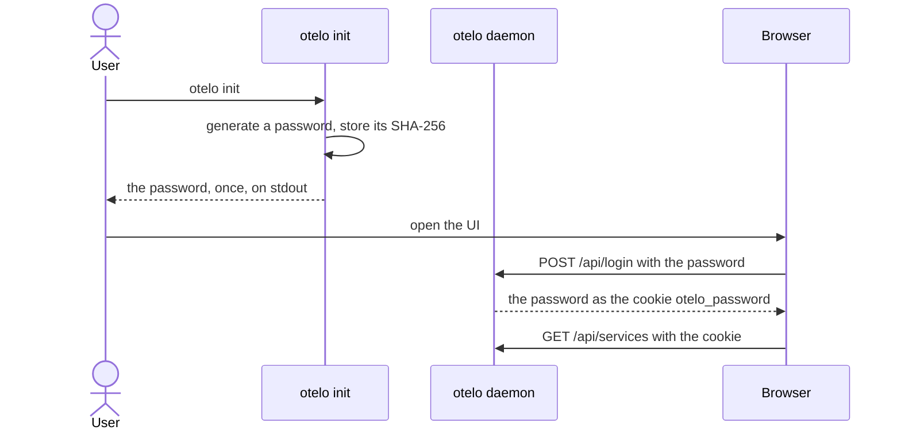

# Log in with a static password

Passkeys and tokens ([[./00013-authenticate-with-passkeys-and-s.md]]) are a large task. To run otelo on the droplet sooner, the UI and the CLI send one password that `otelo init` generates. The daemon still listens on `127.0.0.1`, and Caddy puts the UI on a hostname with HTTPS.

The password is 128 random bits, so it cannot be guessed, and a fast hash keeps it as safe as a slow one. The daemon checks the password itself on every request, and keeps no sessions.

## otelo init

- It takes `--data` as `otelo serve` does. It generates a password of 128 random bits as 26 characters of base32, prints it once on stdout, and stores only its SHA-256 in `state.sqlite`.
- A data directory that has a password already makes `otelo init` refuse. `otelo init --new-password` replaces the password.
- `otelo serve` on a data directory without a password fails the startup and says to run `otelo init`. `mise run serve:dev` runs `otelo init` when the dev data has no password, and keeps it in `target/dev/password`.

## The password in the UI and the CLI

- Every path under `/api` needs the password, except `POST /api/login` and `POST /api/logout`. The files of the UI need none, and the UI shows a login page with one password field when the API answers 401.
- `POST /api/login` checks the password and sets it as the cookie `otelo_password`: `HttpOnly`, `SameSite=Strict`, and `Secure` unless the page is on `http://localhost`. `POST /api/logout` clears the cookie.
- The CLI reads the password from `OTELO_PASSWORD`, as it reads the address from `OTELO_URL`, and sends it as `Authorization: Bearer <password>`.
- The OTLP receivers stay without a password, on `127.0.0.1`.

## Tests

- `otelo init` prints a password and stores only its hash. A second `otelo init` refuses, and `--new-password` replaces the password.
- `otelo serve` without a password fails the startup.
- `/api` answers 401 without the password and with a wrong one, as a bearer token or as the cookie.
- The login sets the cookie for the right password only, and the logout clears it.
- The CLI sends `OTELO_PASSWORD`.

## Comments

### 2026-10-03T16:30:20Z by Milan Suk via claude-code

> No `mise dev` task exists, so `mise run serve:dev` makes the dev password on its first run and keeps it in target/dev/password.
