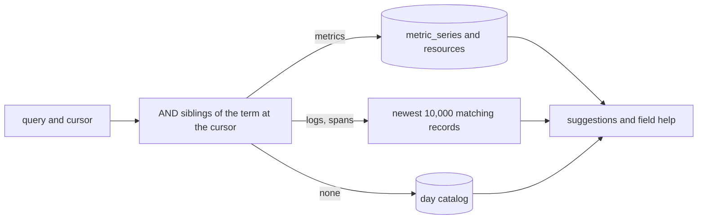

# Suggest only the fields and values that the rest of the query can match

Completion reads the attribute catalog for the whole retention and ignores the rest of the query. In `service = "caddy" and http.` it suggests the attributes of every service, and in `service = "caddy" and http.route = ` it suggests mudro's routes. A suggestion that the other terms rule out returns no rows.

## What changes

- **The picked range.** `/api/complete` takes the range that the query bar or the widget shows, not the retention.
- **The type of the field.** An attribute gets `<`, `<=`, `>`, `>=` only when it holds numbers, and `~` only when it holds strings. A `mixed` attribute keeps them all.
- **Values already written.** `in (...)` leaves out the values that the list already has.
- **The rest of the query.** The fields, the values, and the field help come from the records that the other terms match.
- **The metric of a widget.** The widget editor sends the metric it has selected as part of the context, so its filter suggests the attributes of that metric's series only.

## The context of a term

The context is the terms joined by AND with the term at the cursor, at its level and at each level above it. A sibling joined by OR is not part of it, and neither is a term that does not parse yet. With no context, completion reads the day catalog as it does now.

- **Metrics** are exact: the context filters `metric_series` and `resources`, which are small.
- **Logs and spans** use a sample: the newest 10,000 records in the range that match the context. Keys and values come from their attributes and resources. When the sample is full, the values are marked as incomplete.
- **Values** put the typed prefix in the sample's filter, so a key with many values still finds the ones that match the prefix.
- **No match.** A scan that finishes with no match shows no suggestions. A scan that runs out of its time budget with no match cannot tell, so it falls back to the day catalog.
- **Cache.** Results are cached by context and range, because the context stays the same while the user types one term.

## Why 10,000

Measured on mudro on 2026-10-04: 37,787 spans over the retention, about 19k a day, with 11 attributes each on average.

| Newest N | Keys, all spans | `http.route` values | Query time on a laptop |
|---|---|---|---|
| 5,000 | 32/36 | 33/38 | 18–24 ms |
| 10,000 | 36/36 | 35/38 | 38–52 ms |
| 20,000 | 36/36 | 35/38 | 93–116 ms |

At 10,000 every key appears and the query stays under about 100 ms on the server. The cost of a context that matches few records does not depend on N, because SQLite scans the whole range: about 0.7 µs a span, 1.4 s for 2M spans. That is why the scan needs a time budget.

## Comments

### 2026-10-05T13:22:25Z by Milan Suk via claude-code

> The hover card of a field in the query bar still asks with the field alone, so it follows the range but not the other terms. The field help of a completion follows the context.
