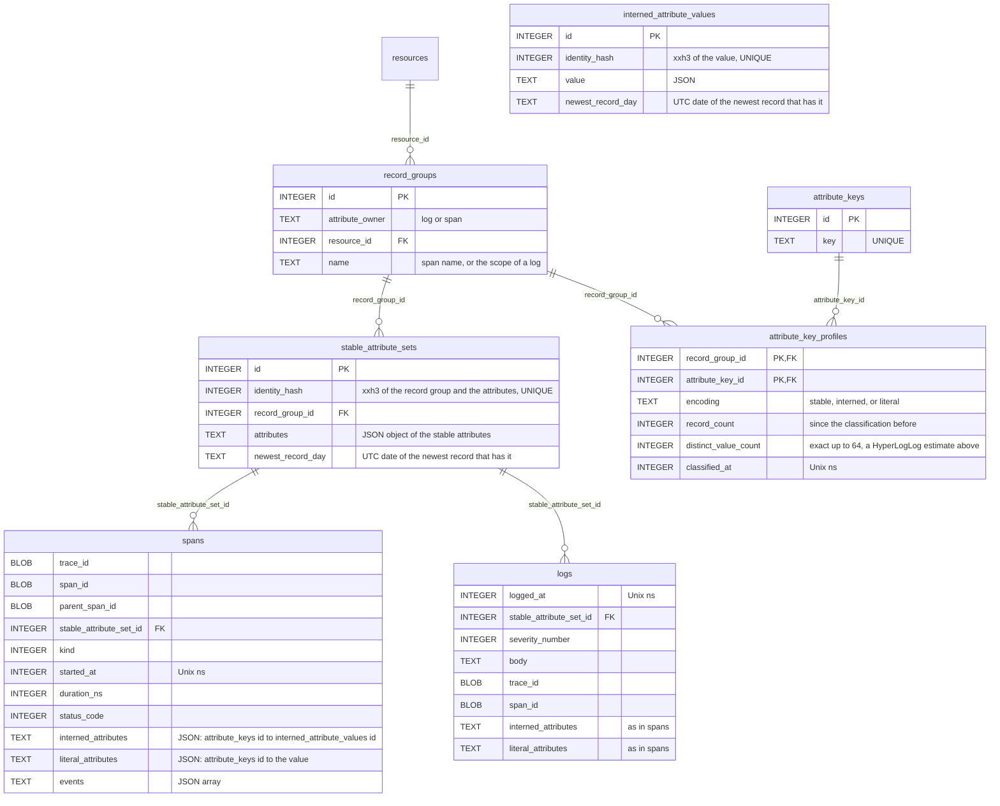

# Store the attributes of logs and spans by how often their values repeat

Span attributes are most of `telemetry.sqlite`, and they repeat. On a copy of mudro's file (445 MB, 4.7 days, 242,270 spans), the `attributes` JSON of the spans is 188 MB, about 810 B a span. There are only 67k distinct attribute objects. Within one span name most keys hold one value or a few. On the 146,941 `SELECT` spans, `busy_ns` is always 0.

The indexer profiles each attribute key within a group of similar records, and stores it in one of three encodings. A prototype of this layout on the mudro spans took the spans and their indexes from 260 MB to 46 MB.

## Encodings

A record group is a resource and a span name, or a resource and the instrumentation scope of a log. `record_groups` keeps one row for each.

| Encoding | Where the value lives | Keys on mudro |
|---|---|---|
| stable | once in a stable set, which the row points to | `code.file.path`, `code.line.number`, `http.route`, `thread.name`, `busy_ns` on SQL spans |
| interned | once in `interned_attribute_values`, and the row holds its id | `db.query.text`, `db.statement`, `url.path`, `client.address` |
| literal | on the row | `busy_ns` on `match woke` spans, `db.sqlite.vm_steps`, `http.response.body.size` |

A stable set belongs to one record group, so a span row carries neither its resource nor its name, and `spans_resource_id_started_at` goes.

## The profiler

For each group and key, the indexer keeps an exact set of up to 64 value hashes and a 64-byte HyperLogLog. On mudro that is about 200 groups of 20 keys, under 3 MB.

- Stable: at most 64 distinct values, each on at least 20 records on average. The product of the value counts of the stable keys of a group stays at most 4,096, so the stable sets of a group cannot multiply without bound.
- Interned: a string, array, or map whose values repeat at least twice on average.
- Literal: the rest. A number is stable or literal, never interned: an interned number costs a value row and its index entry, about 30 B, to save 2 to 4 B on the row.
- A key without a profile goes into the stable set. A constant key then never takes another encoding, and a varying one leaves the set at the first classification, or once it passes 128 values.

The indexer classifies a group at 32 records, again each time its count doubles, and then at least every 4,096 records or every hour of records. It also classifies at once when a stable key passes 128 distinct values since the last classification, by its HyperLogLog, or when the stable sets of the group pass the cap. A classification happens in the transaction of the records it follows, so `attribute_key_profiles` never disagrees with the rows after a crash. The counts start over at each classification, so a profile describes recent records. A key turns stable only at 64 distinct values or fewer and stops being stable only past 128, so a key near the limit does not flip back and forth.

The profiler measures time by the `received_at` of the frames, not the clock, so `otelo reindex` makes the same choices from the same journal.

The encoding only decides where a new record puts a value. Stable sets and interned values never change once written, so a reclassification rewrites no row, and rows of one key in different encodings sit side by side. A wrong or missing profile makes records larger, never wrong.

## Schema



- `spans` and `logs` lose `resource_id`, `spans` loses `name`, and both lose `attributes`. Their index on the resource and the time becomes one on `stable_attribute_set_id` and the time.
- `attribute_key_counts` gains `has_stable_values`, `has_interned_values`, and `has_literal_values`: 1 once a record of the day kept the key in that encoding.
- `record_groups` is unique on `attribute_owner`, `resource_id`, and `name`, and `stable_attribute_sets` has an index on `record_group_id`. A query of a service or a span name finds its record groups, then their stable sets.
- Span events keep their JSON. They are 0.5 MB on mudro.

## Queries

The compiler ORs the flags of the days of the range in `attribute_key_counts`, and writes one branch for each encoding the key had. A key that was only ever stable reads no JSON of the rows.

| Encoding | First | Then the rows |
|---|---|---|
| stable | the stable sets whose attributes match | `stable_attribute_set_id IN (…)` |
| interned | the value by `identity_hash`, or the values that match `~` or `>` | `interned_attributes ->> '$."<key id>"'` = the id, or `IN (…)` |
| literal | | `literal_attributes ->> '$."<key id>"'` compared to the value |

```sql
SELECT …
FROM spans span
WHERE span.started_at BETWEEN :since AND :until
  AND (
    span.stable_attribute_set_id IN (
      SELECT id
      FROM stable_attribute_sets
      WHERE record_group_id IN (
          SELECT id
          FROM record_groups
          WHERE attribute_owner = 'span'
        )
        AND attributes ->> '$."db.query.text"' = :value
    )
    OR span.interned_attributes ->> '$."12"' = (
      SELECT id
      FROM interned_attribute_values
      WHERE identity_hash = :value_hash
    )
  )
```

- A number still matches the same number sent as a string: the lookup takes the hashes of both.
- `!=` and `NOT` negate the whole OR, so they keep the records that lack the key, as today.
- `has(key)` checks for the key in the stable sets and in the two row columns.
- A service or a span name filters the record groups.
- Grouping by an attribute groups by the stable set, the interned value id, and the literal, and reads the text of the values only for the groups the limit keeps.
- A record reads back as one JSON object, from a subquery that joins its stable set, its interned values, and its literals.

## Indexed attributes

A stable key needs no index of its own: `spans_stable_attribute_set_id_started_at` covers it, and the UI counts it as indexed. `otelo index add` makes a partial expression index on each of the two row columns:

```sql
CREATE INDEX "spans_interned_attribute_<hash>" ON spans (json_extract(interned_attributes, '$."12"'))
  WHERE json_extract(interned_attributes, '$."12"') IS NOT NULL;
CREATE INDEX "spans_literal_attribute_<hash>" ON spans (json_extract(literal_attributes, '$."12"'))
  WHERE json_extract(literal_attributes, '$."12"') IS NOT NULL;
```

The index holds only the rows that have the key in that encoding, and SQLite uses it for `=`, `<`, and `>`, which imply `IS NOT NULL`. Both are made when the key is added, so a key that changes encoding later finds its index waiting.

## Retention

The indexer sets `newest_record_day` of a stable set or an interned value to the day of the newest record that uses it, once a day for each, from a set in memory. Retention deletes the stable sets and the interned values whose `newest_record_day` is past the longer of the retentions of logs and spans, after it deletes the rows. A record group with no stable set left goes too, with its `attribute_key_profiles` rows.

## Measured on the mudro spans

A Python prototype built the layout from the spans of the copy. It used the rules above, except that it also interned numbers, and it classified only when the count of a group doubled. The sizes are after a VACUUM.

| Layout | Spans and their indexes |
|---|---|
| Today | 260 MB |
| One `attribute_sets` row for the strings of a span | 84 MB |
| `attributes` and a `span_attributes` link per attribute | 122 MB |
| Adaptive, one profile for all spans | 68 MB |
| Adaptive, a profile per group | 46 MB |

The implementation, fed the 242,270 spans of the mudro copy, made a file of 48.8 MB, against 261 MB for the spans and their indexes before. Every span read back with the attributes it had, and 14 filters matched the same spans as `json_extract` on the old file, in 6 to 200 ms instead of 180 to 430 ms.

| Query | Today | Adaptive |
|---|---|---|
| A key filter that reads the stable sets only | 140 ms | under 10 ms |
| Group by `db.query.text`, interned branch only | 800 ms | 130 ms |
| Delete the oldest day | 430 ms | 100 ms |

## Open questions

- How to group logs. The instrumentation scope is coarse for an app that logs through `tracing`. `code.file.path` and `code.line.number`, when the log has them, name a call site.
- Whether `otelo attributes <signal>` shows the encoding of each key, so a reader sees why one filter is fast and another reads the range.

## Out of scope

- `metric_points` (112 MB on mudro, 32 B a point) and `metric_minute_summaries` (48 MB). Points in hourly chunks of a series would take about 4 B a point. That is a task of its own.
- mudro sends `db.statement` next to an equal `db.query.text` on every database span. Interning stores the text once, and mudro's instrumentation is where to drop the old name.

## Comments

### 2026-10-09T07:07:01Z by Milan Suk via claude-code

> Departs from the plan: a key without a profile starts stable, not interned or literal, so constant keys never leave interned or literal flags on their first day; and a record reads back through an SQL subquery, not a merge in Rust.
