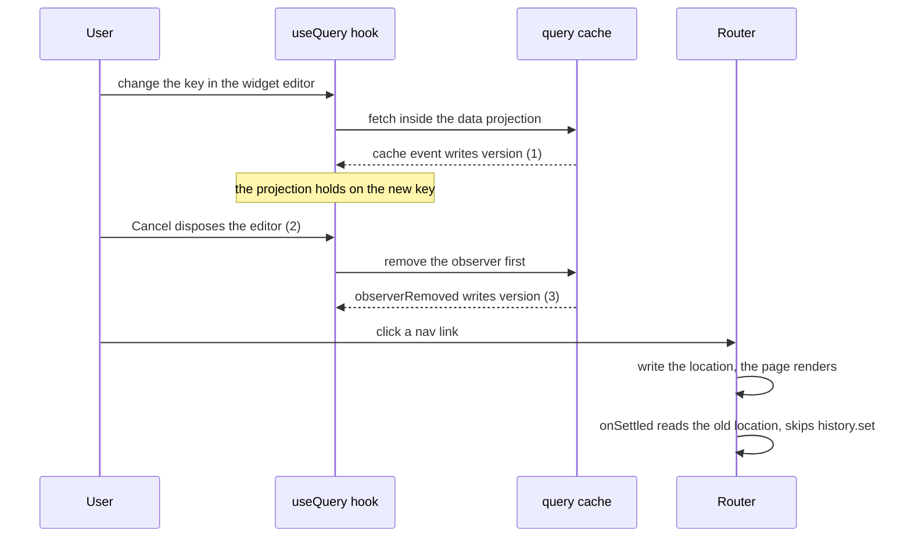

# Report the Solid rc.14 scheduler bug that stops writes committing, and drop the signals patch

The scheduler of Solid rc.14 (`@solidjs/signals`) stops committing writes after a cleanup writes a held signal while its transaction lands. otelo hits it when a page or the widget editor goes away mid-load: the router stops updating the URL for the rest of the session. PR #66 works around it with `patches/@solidjs__signals@2.0.0-rc.14.patch`, one line in each build. This task reports the bug to solidjs/solid, with the fix and a test, and drops the patch once a release has it.

## Done when

- The issue below is filed on solidjs/solid after a person reads it, or opened as a pull request with the fix and the test, with a link to TanStack/query#11903, which concerns the same `version` signal of the solid-query hook.
- A Solid release passes the repro, otelo moves to it, the patch and its `patchedDependencies` entry are gone, and the "Cleanups only release" bullet of the `frontend-typescript` skill no longer names the patch or SIN-31.
- The test "cancelling an edit while its preview loads keeps the next pages navigating" in `packages/app/tests/dashboard-page.test.tsx` passes without the patch.

## The bug

Landing a transaction disposes the owners it replaces. A cleanup that writes a signal the transaction holds goes through `setSignal`, which calls `joinFuture(txOf(el))` for a held node. That sets `flushTransaction` to the landing transaction. `GlobalQueue.settle()` read and cleared `flushTransaction` before the landing, so the join stays behind once the transaction has landed and left `transactions`.

The next flush's `settle()` takes that dead transaction as `joined` and holds every staged write in it, `holdNode(n, t)`. Nothing lands it again. Render effects ran in the pure phase, so the screen shows the write, but `_value` never changes, and a read outside the graph or in `onSettled` returns the old value for good.

It needs three things together, and rc.13 gets all of them right:

1. An async memo writes a signal it reads, created with `ownedWrite`, as it goes pending. That makes the signal held.
2. Its owner is disposed while the hold is open, by the landing.
3. A cleanup writes that signal again.

The fix, in `packages/signals/src/core/scheduler.ts`:

```diff
-    const joined = flushTransaction;
+    const joined = flushTransaction !== null ? liveTx(flushTransaction) : null;
```

Checked against the suite of solidjs/solid at the tag `@solidjs/signals@2.0.0-rc.14`: the repro as a test fails before the change and passes after. The rest of the suite gives the same result with and without it, 22 failures in `dist-artifacts.test.ts` and `diagnostics.test.ts`, which need a built `dist`.

## Repro

`@solidjs/signals` alone, no DOM. Run with `node --conditions=development repro.mjs` against `@solidjs/signals@2.0.0-rc.13` and `@solidjs/signals@2.0.0-rc.14`.

```js
import { createMemo, createRenderEffect, createRoot, createSignal, flush, onCleanup } from "@solidjs/signals";

const [open, setOpen] = createSignal(true);
const [count, setCount] = createSignal(0);
let setKey;
let settle;
let shownCount;

createRoot(() => {
  createRenderEffect(count, (value) => {
    shownCount = value;
  });
  const child = createMemo(() => {
    if (!open()) return undefined;
    const [key, setKeyInChild] = createSignal(0);
    const [version, setVersion] = createSignal(0, { ownedWrite: true });
    setKey = setKeyInChild;
    let pending;
    const data = createMemo(() => {
      version();
      if (key() === 0) return "first";
      if (!pending) {
        pending = new Promise((resolve) => (settle = () => resolve("second")));
        setVersion((v) => v + 1); // 1. a write to a source of this memo while it goes async
      }
      return pending;
    });
    onCleanup(() => setVersion((v) => v + 1)); // 3. a write to the same signal while it is disposed
    return data;
  });
  createRenderEffect(() => child()?.(), () => {});
});

flush();
setKey(1); // the memo goes async, the write is held
flush();
setOpen(false); // 2. dispose the child while the hold is open
flush();
setCount(1); // a write unrelated to all of it
flush();
console.log("after the unrelated write:", { shownCount, count: count() });
settle();
await new Promise((resolve) => setTimeout(resolve, 20));
setCount(2);
flush();
console.log("after the promise settles and another write:", { shownCount, count: count() });
```

```
rc.13  after the unrelated write: { shownCount: 1, count: 1 }
       after the promise settles and another write: { shownCount: 2, count: 2 }
rc.14  after the unrelated write: { shownCount: 1, count: 0 }
       after the promise settles and another write: { shownCount: 2, count: 0 }
```

With the fix, rc.14 prints the rc.13 output.

## How otelo hits it

The hook of `@tanstack/solid-query` 6.0.0-rc.5 does all three. Its fetch inside the data projection fires a cache event that writes its `version` signal, and its cleanup removes the observer, whose `observerRemoved` event writes `version` again. The router then reads the old location in `onSettled` and never writes the history.



The same freeze reproduces with the unpatched hook, the router and no otelo code: it fails on Solid rc.14 with router next.33 and next.37, and passes on rc.13 with next.33. The same fix also ends the router freeze of leaving Services, Logs or Metrics mid-load, which went through RangePicker and Select.

## Issue to file on solidjs/solid

Title: `[2.0 rc.14] A cleanup write to a held signal during a landing leaves settle() joined to the landed transaction, and no later write commits`

Body: the "The bug" and "Repro" sections above, then this paragraph:

> Found through `@tanstack/solid-query` 6.0.0-rc.5, whose `useBaseQuery` does all three: its fetch inside the data projection fires a cache event that writes its `version` signal, and its cleanup removes the observer, so `observerRemoved` writes `version` again. With `@solidjs/router`, the router then reads the old location in `onSettled` and stops updating the history, so every navigation after closing such a component renders its page while the URL stays put. Related: TanStack/query#11903.
