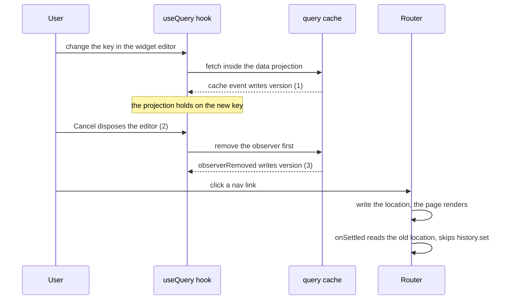

# Report the Solid rc.14 scheduler bug that stops writes committing, and drop the signals patch

The scheduler of Solid rc.14 (`@solidjs/signals`) stops committing writes after a cleanup writes a held signal while its transaction lands. otelo hits it when a page or the widget editor goes away mid-load: the router stops updating the URL for the rest of the session. PR #66 works around it with `patches/@solidjs__signals@2.0.0-rc.14.patch`, two lines in each build. This task reports the bug to solidjs/solid, with the fix and a test, and drops the patch once a release has it.

## Done when

- The issue below is filed on solidjs/solid after a person reads it, or opened as a pull request with the fix and the test, with a link to TanStack/query#11903, which concerns the same `version` signal of the solid-query hook.
- A Solid release passes the repro, otelo moves to it, the patch and its `patchedDependencies` entry are gone, and the "Cleanups only release" bullet of the `frontend-typescript` skill no longer names the patch or SIN-31.
- The test "cancelling an edit while its preview loads keeps the next pages navigating" in `packages/app/tests/dashboard-page.test.tsx` passes without the patch.

## The bug

A cleanup that writes a signal a transaction holds goes through `setSignal`, which calls `joinFuture(txOf(el))` for a held node. That sets `flushTransaction`. When the cleanup runs during the seam, after `GlobalQueue.settle()` has read and cleared `flushTransaction` (the commits of `commitPendingNodes()`, or `land()` disposing the frame it replaces), nothing reads the join in that flush, and nothing clears it. It stays set into the next tick.

The next flush's `settle()` then takes it as `joined` and holds every staged write in it, `holdNode(n, t)`:

- If the transaction has landed, nothing lands it again. Render effects ran in the pure phase, so the screen shows the write, but `_value` never changes, and a read outside the graph or in `onSettled` returns the old value for good.
- If it is still waiting on another flight, an unrelated write waits for that flight.
- If an effect writes in the same drain, after a landing the join pointed at, the next round holds that write in the landed transaction.

rc.13 gets all three right. The cleanup's write only joins when the signal is held, so it needs three things together:

1. An async memo writes a signal it reads, created with `ownedWrite`, as it goes pending. That makes the signal held.
2. Its owner is disposed while the hold is open.
3. A cleanup writes that signal again.

The fix, in `packages/signals/src/core/scheduler.ts`, drops the join at its two ends. `land(u)` clears a join to `u` after its commits, which can run the cleanup themselves, and the drain in `flush()` clears a join no later round consumed:

```diff
diff --git a/packages/signals/src/core/scheduler.ts b/packages/signals/src/core/scheduler.ts
index 3fa558f..503dbeb 100644
--- a/packages/signals/src/core/scheduler.ts
+++ b/packages/signals/src/core/scheduler.ts
@@ -1014,6 +1014,9 @@ function land(u: Transaction): void {
     n._x!._transaction = null;
     commitPendingNode(n);
   }
+  // A join made since the seam read `flushTransaction`, by a cleanup writing a
+  // node `u` held, has nothing left to join once `u` has landed.
+  if (flushTransaction !== null && resolveTx(flushTransaction) === u) flushTransaction = null;
   releaseQueues(u);
 }
 
@@ -1307,6 +1310,9 @@ export function flush<T>(fn?: () => T): T | void {
     globalQueue.flush();
     if (__OBSERVE__) drained = true;
   }
+  // A join made after the last seam of the drain holds none of its writes, and
+  // the next tick's writes are not this one's.
+  flushTransaction = null;
   // Outside every try in this function (see the rule in attribution-hooks.ts):
   // the drain loop above is the one place all scheduled work funnels through,
   // so this is the "committed and effects ran" instant for everything the
```

Each guard covers a case the other misses: clearing at the drain end alone loses the effect's write in the same drain, and the guard in `land()` alone leaves a join to a transaction still in flight. A first attempt, `liveTx(flushTransaction)` in `settle()`, left the in-flight case open.

Checked against the suite of solidjs/solid at the tag `@solidjs/signals@2.0.0-rc.14` with `tests/join-after-seam.test.ts` below: its three tests fail without the fix and pass with it. The rest of the suite gives the same result either way, 22 failures in `dist-artifacts.test.ts` and `diagnostics.test.ts`, which need a built `dist`.

The question for the maintainers: whether a join made in the effect phase is meant to carry into the next tick. The fix assumes it is not, as the comment on `flushTransaction` says ("the next tick's writes are not this one's"), and no test in the suite says otherwise.

## Tests for the fix

```ts
import { createMemo, createRenderEffect, createRoot, createSignal, flush, onCleanup } from "../src/index.js";

// A child whose async memo writes its own `ownedWrite` source as it goes
// pending, and whose cleanup writes that source again: the cleanup's write
// joins the held transaction after the seam has read `flushTransaction`.
function createHeldChild(key: () => number, open: () => boolean) {
  return createMemo(() => {
    if (!open()) return undefined;
    const [version, setVersion] = createSignal(0, { ownedWrite: true });
    let pending: Promise<string> | undefined;
    const data = createMemo(() => {
      version();
      if (key() === 0) return "first";
      if (!pending) {
        pending = new Promise<string>(() => {});
        setVersion(v => v + 1);
      }
      return pending;
    });
    onCleanup(() => setVersion(v => v + 1));
    return data;
  });
}

it("a write after a cleanup joined a transaction that landed commits", () => {
  const [open, setOpen] = createSignal(true);
  const [key, setKey] = createSignal(0);
  const [count, setCount] = createSignal(0);
  let shownCount: number | undefined;
  createRoot(() => {
    createRenderEffect(count, value => {
      shownCount = value;
    });
    const child = createHeldChild(key, open);
    createRenderEffect(
      () => child()?.(),
      () => {}
    );
  });
  flush();
  setKey(1);
  flush();
  setOpen(false);
  flush();
  setCount(1);
  flush();
  expect(shownCount).toBe(1);
  expect(count()).toBe(1);
});

it("a write after a cleanup joined a transaction still in flight does not wait for it", () => {
  const [open, setOpen] = createSignal(true);
  const [key, setKey] = createSignal(0);
  const [count, setCount] = createSignal(0);
  let shownCount: number | undefined;
  createRoot(() => {
    createRenderEffect(count, value => {
      shownCount = value;
    });
    const kept = createMemo(() => (key() === 0 ? "first" : new Promise<string>(() => {})));
    createRenderEffect(kept, () => {});
    const child = createHeldChild(key, open);
    createRenderEffect(
      () => child()?.(),
      () => {}
    );
  });
  flush();
  setKey(1);
  flush();
  setOpen(false);
  flush();
  setCount(1);
  flush();
  expect(shownCount).toBe(1);
  expect(count()).toBe(1);
});

it("an effect's write in the drain where a cleanup joined a landing transaction commits", () => {
  const [open, setOpen] = createSignal(true);
  const [key, setKey] = createSignal(0);
  const [other, setOther] = createSignal(0, { ownedWrite: true });
  let shownOther: number | undefined;
  createRoot(() => {
    createRenderEffect(other, value => {
      shownOther = value;
    });
    const child = createHeldChild(key, open);
    createRenderEffect(
      () => child()?.(),
      () => {}
    );
    createRenderEffect(child, value => {
      if (!value) setOther(1);
    });
  });
  flush();
  setKey(1);
  flush();
  setOpen(false);
  flush();
  expect(shownOther).toBe(1);
  expect(other()).toBe(1);
});
```

## Repro

`@solidjs/signals` alone, no DOM. Run with `node --conditions=development repro.mjs` against `@solidjs/signals@2.0.0-rc.13` and `@solidjs/signals@2.0.0-rc.14`.

```js
import { createMemo, createRenderEffect, createRoot, createSignal, flush, onCleanup } from "@solidjs/signals";

const [open, setOpen] = createSignal(true);
const [count, setCount] = createSignal(0);
let setKey;
let settle;
let shownCount;

createRoot(() => {
  createRenderEffect(count, (value) => {
    shownCount = value;
  });
  const child = createMemo(() => {
    if (!open()) return undefined;
    const [key, setKeyInChild] = createSignal(0);
    const [version, setVersion] = createSignal(0, { ownedWrite: true });
    setKey = setKeyInChild;
    let pending;
    const data = createMemo(() => {
      version();
      if (key() === 0) return "first";
      if (!pending) {
        pending = new Promise((resolve) => (settle = () => resolve("second")));
        setVersion((v) => v + 1); // 1. a write to a source of this memo while it goes async
      }
      return pending;
    });
    onCleanup(() => setVersion((v) => v + 1)); // 3. a write to the same signal while it is disposed
    return data;
  });
  createRenderEffect(() => child()?.(), () => {});
});

flush();
setKey(1); // the memo goes async, the write is held
flush();
setOpen(false); // 2. dispose the child while the hold is open
flush();
setCount(1); // a write unrelated to all of it
flush();
console.log("after the unrelated write:", { shownCount, count: count() });
settle();
await new Promise((resolve) => setTimeout(resolve, 20));
setCount(2);
flush();
console.log("after the promise settles and another write:", { shownCount, count: count() });
```

```
rc.13  after the unrelated write: { shownCount: 1, count: 1 }
       after the promise settles and another write: { shownCount: 2, count: 2 }
rc.14  after the unrelated write: { shownCount: 1, count: 0 }
       after the promise settles and another write: { shownCount: 2, count: 0 }
```

With the fix, rc.14 prints the rc.13 output.

## How otelo hits it

The hook of `@tanstack/solid-query` 6.0.0-rc.5 does all three. Its fetch inside the data projection fires a cache event that writes its `version` signal, and its cleanup removes the observer, whose `observerRemoved` event writes `version` again. The router then reads the old location in `onSettled` and never writes the history.



The same freeze reproduces with the unpatched hook, the router and no otelo code: it fails on Solid rc.14 with router next.33 and next.37, and passes on rc.13 with next.33. The same fix also ends the router freeze of leaving Services, Logs or Metrics mid-load, which went through RangePicker and Select.

## Issue to file on solidjs/solid

Title: `[2.0 rc.14] A cleanup write to a held signal during the seam leaves its join set past the flush, and later writes are held in that transaction`

Body: the "The bug", "Tests for the fix" and "Repro" sections above, then this paragraph. Or open a pull request with the fix and the tests, and the same text.

> Found through `@tanstack/solid-query` 6.0.0-rc.5, whose `useBaseQuery` does all three: its fetch inside the data projection fires a cache event that writes its `version` signal, and its cleanup removes the observer, so `observerRemoved` writes `version` again. With `@solidjs/router`, the router then reads the old location in `onSettled` and stops updating the history, so every navigation after closing such a component renders its page while the URL stays put. Related: TanStack/query#11903.
