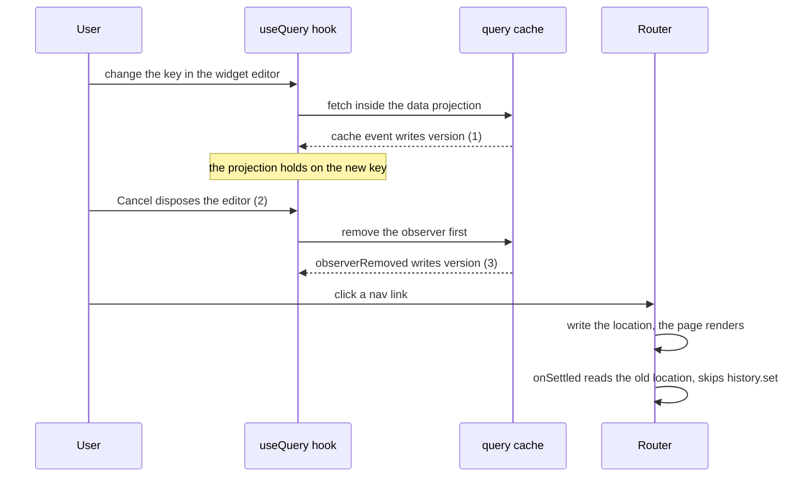

# Report the Solid rc.14 regression that stops writes committing, and drop the solid-query patch

Solid rc.14 loses every later write once a held async memo is disposed in a certain way. otelo hits it through `@tanstack/solid-query`: closing the widget editor while its preview loads froze the router for the rest of the session. PR #66 works around it with `patches/@tanstack__solid-query@6.0.0-rc.5.patch`. This task reports the regression to solidjs/solid and drops the patch once Solid fixes it.

## Done when

- The issue below is filed on solidjs/solid, after a person reads it, with a link to TanStack/query#11903, which concerns the same `version` signal of the hook.
- A Solid release passes the repro, otelo moves to it, the patch and its `patchedDependencies` entry are gone, and the "Cleanups only release" bullet of the `frontend-typescript` skill no longer names the patch.
- The test "cancelling an edit while its preview loads keeps the next pages navigating" in `packages/app/tests/dashboard-page.test.tsx` passes without the patch.

## The regression

It needs three things together. Each pair alone works.

1. An async memo writes a signal it reads, created with `ownedWrite`, as it goes pending.
2. Its owner is disposed while the hold is open.
3. A cleanup writes that signal again.

After that, a write to any unrelated signal reaches render effects but never commits. A read outside the graph, top-level code or `onSettled`, returns the old value, and keeps returning it after the promise settles. rc.13 is correct.

| Write in the compute | Disposed mid-hold | Write in cleanup | rc.13 | rc.14 |
|---|---|---|---|---|
| yes | yes | yes | kept | lost |
| any other combination | | | kept | kept |

## Repro

`@solidjs/signals` alone, no DOM. Run with `node --conditions=development repro.mjs` against `@solidjs/signals@2.0.0-rc.13` and `@solidjs/signals@2.0.0-rc.14`.

```js
import { createMemo, createRenderEffect, createRoot, createSignal, flush, onCleanup } from "@solidjs/signals";

const [open, setOpen] = createSignal(true);
const [count, setCount] = createSignal(0);
let setKey;
let settle;
let shownCount;

createRoot(() => {
  createRenderEffect(count, (value) => {
    shownCount = value;
  });
  const child = createMemo(() => {
    if (!open()) return undefined;
    const [key, setKeyInChild] = createSignal(0);
    const [version, setVersion] = createSignal(0, { ownedWrite: true });
    setKey = setKeyInChild;
    let pending;
    const data = createMemo(() => {
      version();
      if (key() === 0) return "first";
      if (!pending) {
        pending = new Promise((resolve) => (settle = () => resolve("second")));
        setVersion((v) => v + 1); // 1. a write to a source of this memo while it goes async
      }
      return pending;
    });
    onCleanup(() => setVersion((v) => v + 1)); // 3. a write to the same signal while it is disposed
    return data;
  });
  createRenderEffect(() => child()?.(), () => {});
});

flush();
setKey(1); // the memo goes async, the write is held
flush();
setOpen(false); // 2. dispose the child while the hold is open
flush();
setCount(1); // a write unrelated to all of it
flush();
console.log("after the unrelated write:", { shownCount, count: count() });
settle();
await new Promise((resolve) => setTimeout(resolve, 20));
setCount(2);
flush();
console.log("after the promise settles and another write:", { shownCount, count: count() });
```

```
rc.13  after the unrelated write: { shownCount: 1, count: 1 }
       after the promise settles and another write: { shownCount: 2, count: 2 }
rc.14  after the unrelated write: { shownCount: 1, count: 0 }
       after the promise settles and another write: { shownCount: 2, count: 0 }
```

## How otelo hits it

The hook of `@tanstack/solid-query` 6.0.0-rc.5 does all three. The router then reads the stale location in `onSettled` and never writes the history.



The same freeze reproduces with the unpatched hook, the router and no otelo code: it fails on Solid rc.14 with router next.33 and next.37, and passes on rc.13 with next.33. The patch swaps the two lines of the hook's cleanup so the cache listener goes first, which removes step 3.

## Issue to file on solidjs/solid

Title: `[2.0 rc.14, regressed after rc.13] Writes stop committing after a held memo that writes its own source is disposed and a cleanup writes it again`

Body: the "The regression" and "Repro" sections above, then this paragraph:

> Found through `@tanstack/solid-query` 6.0.0-rc.5, whose `useBaseQuery` does all three: its fetch inside the data projection fires a cache event that writes its `version` signal, and its cleanup removes the observer before the cache listener, so `observerRemoved` writes `version` again. With `@solidjs/router`, the router then reads the old location in `onSettled` and stops updating the history, so every navigation after closing such a component renders its page while the URL stays put. Related: TanStack/query#11903.
